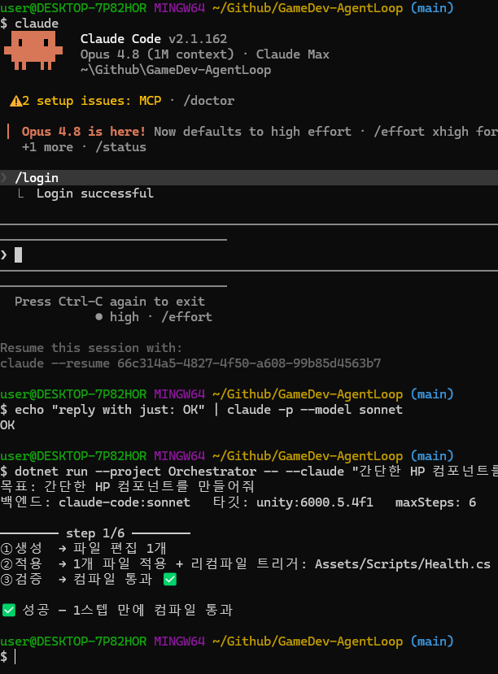

# GameDev-AgentLoop

[English](README.md)

[](https://github.com/SeoBYP/GameDev-AgentLoop/actions/workflows/ci.yml)
[](LICENSE)
[](https://unity.com/)
[](https://dotnet.microsoft.com/)


> AI가 짠 Unity 코드가 **정말 도는지, 잘 만들었는지, 충분히 빠른지**를
> 실제로 실행해 검증하고 스스로 고치는 **닫힌 루프**.

대부분의 AI 코딩 데모는 *"코드를 생성했다"* 에서 끝난다. 하지만 게임 개발에서 진짜 질문은 그다음이다 —
**컴파일은 되나? 의도대로 동작하나? 프레임 예산 안에 드나?**
이 오케스트레이터는 그 질문들을 **측정으로 답하고, 실패하면 되먹여 고친다.**



---

## 이 프로젝트가 실제로 증명한 것

각 단계는 **한 겹씩 더 깊은 "성공의 정의"** 를 강제한다.
전부 API 키 없이 돌려 볼 수 있는 결정적 데모로 재현된다.

| 검증 층 | 통과해도 놓치는 것 | 어떻게 잡나 |
|---|---|---|
| ③-a **컴파일** | *"그럴듯한데 안 도는 코드"* | `recompile_status` 로 실제 컴파일 에러 수집 |
| ③-b **런타임 동작** | *"컴파일은 되는데 로직이 틀린 코드"* | **Unity Test Runner** (없으면 플레이모드 `eval` assert) |
| ③-b′ **시나리오·입력** | *"한 프레임만 보면 맞아 보이는 코드"* | `[UnityTest]` 코루틴 + **가상 입력 주입** |
| ③-c **성능 예산** | *"동작은 맞는데 매 프레임 할당하는 코드"* | 핫패스를 5만 회 돌려 **경과 시간 실측** |
| ③-c′ **렌더 예산** | *"빠른데 드로우콜을 폭증시키는 코드"* | 씬에 남기는 **드로우콜·삼각형 증가분 실측** |
| ①-b **도메인 품질** | *"돌지만 잘못 만든 코드"* | 스킬 정적 검사로 **적용 전 반려** |

검증은 **자산으로 남는다** — AI가 구현과 함께 PlayMode 테스트를 작성하고,
그 테스트는 레포에 남아 이후 실행마다 회귀를 잡는다.

### 실측 로그 — "동작 정상 ≠ 충분히 빠름"

```
step 1  ③ 컴파일 통과 ✅
        ③ 플레이모드 assert 통과 ✅     ← 동작은 정확하다
        ③ 성능 예산 초과 ❌  ScoreTracker: 50000회 41.03ms (호출당 0.82µs)
                             [프로파일: drawCalls=24 mono=943MB cpuFrame=2.55ms]
step 2  ③ 성능 예산 통과 ✅  ScoreTracker: 50000회 11.82ms (호출당 0.24µs)

✅ 성공 — 2스텝 만에 동작 + 성능까지 검증 통과
```

핫패스에서 매 호출 `List` 를 새로 만들던 구현이 **동작 검증은 통과**했지만 성능 실측에서 걸렸고,
버퍼 재사용으로 고쳐 **3.5배** 빨라졌다. 정적 분석의 "추측"이 아니라 **측정**이다.

---

## 빠른 시작

### 전제 도구

| | 왜 필요한가 |
|---|---|
| **Unity 6** (6000.x) + `com.unity.pipeline` | **실행 중인** 에디터를 조작 — 리컴파일·플레이모드·`eval`·프로파일 통계 |
| **Unity CLI** (`unity`) | 그 에디터 내 서버와 통신하는 브리지 |
| **.NET 10 SDK** | 오케스트레이터 빌드·실행 |
| **두뇌** — 셋 중 하나: `claude` CLI · `codex` CLI · `ANTHROPIC_API_KEY` | CLI 는 API 키 없이 로그인만으로 동작 |

> 대상 Unity 프로젝트가 **에디터에서 열려 있어야** 한다 — pipeline 서버가 그 안에서 돌기 때문.
> `unity pipeline list` 로 서버 연결 가능 여부를 확인한다.

### 설치

아직 NuGet 에 게시하지 않았으므로 소스에서 빌드한다.

```bash
git clone https://github.com/SeoBYP/GameDev-AgentLoop.git
cd GameDev-AgentLoop
dotnet pack Orchestrator -c Release -o ./nupkg
dotnet tool install -g --add-source ./nupkg GameDev.AgentLoop
```

### 내 Unity 프로젝트에 쓰기

```bash
cd /경로/내-Unity-프로젝트
agentloop --init
```

`--init` 은 런타임/테스트 asmdef 한 쌍을 만든다. 이게 중요한 이유가 있다 —
**Unity 테스트 asmdef 은 `Assembly-CSharp` 을 참조할 수 없어서**, asmdef 이 없는 프로젝트에서는
PlayMode 테스트가 **원리적으로 컴파일되지 않는다.** 이 단계를 건너뛰면 루프는 일회용 `eval`
assert 로 조용히 축소된다. 기존 파일은 절대 덮어쓰지 않는다.

```bash
agentloop --claude "현재/최대 체력을 갖고 양끝에서 클램프되는 HP 컴포넌트를 만들어줘"
```

### API 키 없이 루프 확인하기

각 데모는 **한 부류의 실패**를 결정적으로 재현하고 수리한다.

```bash
agentloop --demo         # 컴파일 에러        → 자가수리
agentloop --demo-play    # 컴파일은 되는데 동작이 틀림
agentloop --demo-skills  # 도메인 규칙 위반   → 적용 전 반려
agentloop --demo-perf    # 동작은 맞으나 핫패스에서 할당
agentloop --demo-draw    # 빠르지만 드로우콜 폭증
```

전체 옵션은 `agentloop --help`.

---

## 어떻게 동작하나

```
목표(자연어)
 → ① 생성    백엔드가 전체 파일을 뱉는다 (텍스트만, 도구 없음)
 → ①-b 검사  도메인 정적 규칙 — 프로젝트를 건드리기 전에 반려
 → ② 적용    파일 쓰기 + 리컴파일 트리거
 → ③ 검증    컴파일 → 테스트/assert → 시간 예산 → 렌더 예산
 → ④ 피드백  실패를 다음 프롬프트에 되돌림
 → ⑤ 판정    통과 → 종료 / 실패 → ①로 (--max-steps 가드)
```

**루프는 우리 것이다.** AI 백엔드는 `맥락 → 텍스트` 계약만 갖는 **도구 없는** 순수 생성기로 쓰고,
적용·검증·재시도·판정은 오케스트레이터가 소유한다. 그래서 백엔드가 **진짜로 교체 가능**하다.

```
        ┌──────────── Orchestrator (C#) : 루프 소유 ────────────┐
        │  ①생성 → ①-b품질 → ②적용 → ③검증 → ④피드백 → ⑤판정   │
        └──┬──────────────────────────────────┬────────────────┘
     IAgentBackend (두뇌)                IExecTarget (손)
   ├ ClaudeCodeBackend  키 없음        ├ UnityEditorTarget  클라 (unity CLI)
   ├ CodexBackend       키 없음        └ UgsTarget          백엔드 (ugs CLI + REST)
   ├ ApiBackend         API 키
   └ ScriptedBackend    데모
```

- **agent-agnostic 실증** — Claude Code 와 Codex, 서로 다른 두 CLI 에이전트가
  **루프 코드 변경 0** 으로 같은 루프를 돌았다.
- **손이 바뀌면 만들 것도 검증도 바뀐다** — Unity 타깃은 C# 을 만들어 컴파일·플레이모드로 검증하고,
  UGS 타깃은 Cloud Code JS 를 만들어 배포·REST 호출로 검증한다.
  그래서 `IExecTarget` 이 자기 생성 규격과 가능한 검증을 **스스로 선언**한다(`--print-prompt` 로 확인).

| | `--target unity` | `--target ugs` |
|---|---|---|
| 산출물 | C# 컴포넌트 | Cloud Code JS |
| 1차 검증 | 컴파일 | **배포** (`ugs deploy`) |
| 런타임 검증 | 플레이모드 테스트/assert | **스크립트 호출** (Cloud Code REST) |
| 성능 검증 | 핫패스 시간 실측 | — |

---

## 도메인 스킬

`Skills/*.md` 는 두 부분을 가진 포터블 마크다운이다.

- **`GUIDANCE`** — 시스템 프롬프트에 주입 (예방)
- **`CHECKS`** — 코드를 적용하기 **전에** 도는 정적 검사 (강제)

도구와 함께 배포되므로 어떤 프로젝트를 가리켜도 적용된다.
프로젝트에 `Skills/` 폴더가 있으면 그쪽이 우선한다.

```bash
agentloop --list-skills      # 어떤 스킬·검사가 적용되는지
agentloop --skills off       # 끄기
```

> 검사를 추가할 때는 "이론상 나쁜 것"이 아니라 **모델이 실제로 하는 실수**를 겨냥하고,
> 기존 산출물로 **오탐부터 확인**한다. 처음 만든 정적 검사 5개는 아무것도 못 잡았다 —
> 요즘 모델은 기본기가 좋다.

---

## 정직한 한계

- **`eval` 은 샌드박스가 아니다.** 검증 스니펫은 **사용자의 에디터 프로세스** 안에서 돌고,
  그 프로세스는 오케스트레이터가 소유하지 않는다. `SnippetGuard` 가 파일·프로세스·네트워크·레지스트리
  접근을 정적으로 막지만 문자열 조립으로 우회할 수 있다. `--tests-only` 로 임시 스니펫 실행을
  아예 없애고 **컴파일된 테스트 파일로만** 검증할 수 있다.
- **절대 ms 예산은 기기 의존적이다.** *상대* 신호로는 유용하지만, 같은 코드가 13.9ms↔11.9ms 로
  흔들려서 마진을 넓게 잡아야 한다.
- **메모리는 예산이 아니라 진단이다.** Unity Mono 는 Boehm GC 라 `monoUsedBytes` 가 부하 중에
  **감소하기도** 한다 — 판정 기준으로 쓸 수 없다. 그래서 시간·렌더 지표만 예산으로 쓴다.
- **UGS 는 호출까지 검증한다.** 그 외 클라우드 프로젝트 상태는 검증하지 않는다.

---

## 개발하며 실제로 부딪힌 문제들

문서에 결과만 적지 않고 **함정과 그 해결**을 남겼다. 몇 가지:

- **에디트 모드에선 `Awake` 가 안 돈다** → 진짜 플레이모드 진입이 필요했다.
- **리컴파일 직후엔 플레이모드 진입이 조용히 거부된다** → 초기엔 이 인프라 실패를
  *"네 코드가 틀렸다"* 로 AI에게 되먹여 멀쩡한 코드를 재생성하며 스텝을 낭비했다.
  → ready 게이팅 + 재시도, **인프라 실패는 피드백하지 않고 중단**하도록 수정.
- **Unity Mono 는 Boehm GC** 라 `GC.CollectionCount`/`GetTotalAllocatedBytes` 가 무용지물이었다.
  → 할당을 **시간**으로 측정하도록 방향 전환(무할당 4.8ms vs 매 호출 할당 30.2ms).
- **`TouchPhase` 는 `UnityEngine` 과 `UnityEngine.InputSystem` 양쪽에 있다** → 정규화하지 않으면
  CS0104 로 깨진다. 다른 입력 장치엔 없던 함정이라 실제로 짜 보기 전엔 안 드러났다.
- **UGS: `module.exports.params` 를 빠뜨리면 파라미터가 걸러진다** → 배포는 성공하는데 로직이 틀렸다.
  *"배포 성공 ≠ 동작 정상"* 을 만들다가 직접 겪었다.

---

## 문서

| 경로 | 내용 |
|---|---|
| [docs/ARCHITECTURE.ko.md](docs/ARCHITECTURE.ko.md) | 실행 그래프·트레이스 트리·자기개선 설계 (Mermaid 흐름도) |
| [Orchestrator/](Orchestrator/README.md) | 루프 소유자 — 계약·백엔드·타깃·검증 |
| [Skills/](Skills/README.md) | 도메인 지식 레이어 — 지침(예방) + 정적 검사(강제) |
| [docs/DESIGN.md](docs/DESIGN.md) | 설계와 근거(Decision Log) — *왜* 이렇게 정했는지 |
| [docs/WORKLOG.md](docs/WORKLOG.md) | 작업 로그 — 무엇에 부딪혔고 어떻게 고쳤는지 |

---

## 기여

이슈와 PR 환영합니다 — [CONTRIBUTING.ko.md](CONTRIBUTING.ko.md) 참고.

무엇보다 중요한 규칙 하나: **이 프로젝트는 재지 않은 것을 주장하지 않는다.**
검증 층이나 예산을 추가한다면 그게 실제로 동작함을 보이는 **측정**을 함께 넣고,
확인하지 못한 것은 그렇다고 표시한다.

## 라이선스

[MIT](LICENSE)
