# 아키텍처 — 검증되는 루프

[English](ARCHITECTURE.md)

> **흐름**을 정의하는 문서다. *왜* 그렇게 정했는지의 결정 근거는 [DESIGN.md](DESIGN.md),
> 무엇을 하며 무엇에 부딪혔는지는 [WORKLOG.md](WORKLOG.md) 에 있다.

표기 — **[현재]**: 코드에 있음 · **[계획]**: 아직 없음 · **[미실측]**: 재기 전엔 주장하지 않음.
이 구분을 흐리지 않는 것이 이 프로젝트의 규율이다.

---

## 0. 관통 원칙

> **틀릴 수 있는 것은 검증하고 되먹인다.**

코드만이 아니다. **테스트**도 틀릴 수 있고(§4.2), **예산**도(§9.1), **계획**도(§2) 틀릴 수 있다.
**코드가 존재하는 이유**조차 틀릴 수 있다(§8).
전부 같은 취급을 받는다 — 판정 기준을 세우고, 재고, 실패하면 되돌린다.

한 번의 실행은 네 층으로 내려간다. 그 층들이 **하나의 트레이스 트리**로 묶이고(§6),
실행들 사이에서 그 기록이 판정 기준과 도메인 지식을 갱신한다(§8).

앞이 없으면 결과를 믿을 수 없고, 뒤가 없으면 어제와 똑같은 실수를 오늘도 한다.

---

## 1. 전체 지도

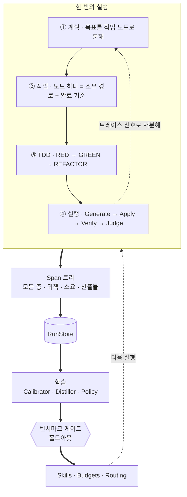

| 층 | 무엇을 정하나 | 절 |
|---|---|---|
| ① 계획 | 목표를 **무엇으로 쪼갤지**. 이것도 검증 대상 | §2 |
| ② 작업 | 노드 하나의 **경계와 완료 기준** | §3 |
| ③ TDD | 한 노드를 **어떤 순서로** 초록으로 만드나 | §4 |
| ④ 실행 | 한 단계를 **어떻게 적용·검증**하나 | §5 |
| 기록 | 위 전부를 **하나의 트리로** | §6 |
| 학습 | 실행들 **사이에서** 기준을 갱신 | §9 |

여기에 공유 자원을 지키는 두 축이 가로지른다 —
**공간**(한 에디터를 여러 세션이, §7)과 **시간**(한 코드베이스에 기능이 쌓인다, §8).

**학습은 실행의 핫패스에 끼어들지 않는다.** 별도 명령으로 돌고, 실행은 그 *결과물만* 읽는다.
그래야 어떤 실행이든 "그때 어떤 스킬·예산이었는지"가 고정되고 사후 재현이 된다.

---

## 2. 계획 층 — 분해도 루프의 대상이다

작업 그래프는 사람이 주는 게 아니라 **Agent 가 낸다.** 그러면 당연히 틀릴 수 있다.
따라서 루프가 두 겹이 된다.

| | 안쪽 루프 (§5) | 바깥 루프 (§2) |
|---|---|---|
| 고치는 대상 | **코드** | **계획(분해)** |
| 실패 신호 | 컴파일 · 테스트 · 예산 | **트레이스 신호** |
| 되먹임 | 에러 → 모델 | 트레이스 요약 → 모델 |
| 1스텝 비용 | 모델 호출 1회 | 작업 그래프 **전체 실행** |

바깥 루프도 **같은 5단계**다 — 생성(분해) → 적용(그래프 확정) → 검증(돌려 보고 신호 수집)
→ 피드백 → 판정. 같은 엔진이 한 층 위에서 다시 도는 것뿐이다.

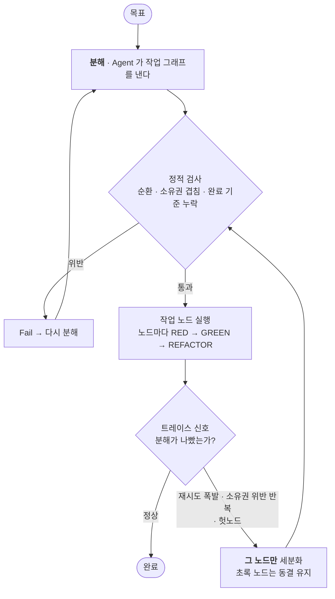

### 2.1 분해의 산출물은 노드 목록이 아니다

각 노드에 **무엇으로 끝났다고 판정하나**가 없으면 검증이 불가능하다. 그래서 튜플이어야 한다.

```
{ id, 목표, owns[], reads[], dependsOn[], 완료기준 }
```

**`완료기준` 이 그대로 그 노드의 테스트가 된다** → RED 게이트(§4.2)가 그 테스트를 검증한다.
분해 → 완료 기준 → 테스트 → RED 게이트가 한 줄로 이어진다.

### 2.2 나쁜 분해의 신호 — 이미 관측하고 있다

바깥 루프가 성립하는 이유는 **분해를 평가할 계측이 이미 있기 때문**이다(§6 Span 트리).

| 신호 | 트레이스에서 | 무엇이 틀렸나 | |
|---|---|---|---|
| 한 Work span 재시도 N회 초과 | Work 재시도 수 | **노드가 너무 크다** | 동적 |
| 소유권 위반이 같은 노드에서 반복 | Apply 의 `Fail` 사유 | **경계가 틀렸다** — 남의 파일을 건드려야 끝난다 | 동적 |
| RED 게이트 헛통과 반복 | RedGate `Fail` | **실질 없는 노드** — 검증할 게 없다 | 동적 |
| 뒤 노드가 앞 노드 타입을 못 찾음 | VerifyCompile 패턴 | **의존 순서가 뒤바뀜**, *또는* `reads` 가 전달되지 않음 — 아래 | 정적 |
| A → B → A | 작업 그래프 자체 | **순환 의존** | 정적 |

**[현재] 네 번째 신호는 원인이 둘인데, 이 표는 하나만 적고 있었다.** `Sample/Roguelike` 슬라이스 3에서
실측했다 — 의존 순서는 **맞았는데도**(그리드 → 액터 → 이동) 4스텝 전부 `CS0246` 으로 실패했다.
루프가 컨텍스트에 넣는 건 목표 + 모델 자기 과거 응답 + 검증 에러뿐이고 **프로젝트 상태는 안 넣는다.**
그러니 네임스페이스도 멤버 이름도 추측밖에 할 수 없었다.

둘을 가르는 건 기계적이다: 못 찾은 타입이 **앞선** 노드의 산출물이면 순서는 정상이고 `reads` 가 빠진 것,
**뒤** 노드의 것이면 순서가 뒤바뀐 것이다. 즉 이 행은 에러 문구가 아니라 **참조된 노드가 언제 돌았는지**로 갈린다.

전달 수단은 [`ProjectSurface`](../Orchestrator/Targets/ProjectSurface.cs) 다 — 기존 공개 표면
(네임스페이스·타입·**생성자**·멤버 시그니처, 몸통은 버림)을 시스템 프롬프트에 붙인다.
같은 목표·같은 백엔드로 실측:

| `reads` 전달 방식 | 스텝 | 결과 |
|---|---|---|
| 없음 | 4 | ❌ 포기, `CS0246` 진동 — 스텝 3·4가 스텝 1의 에러 좌표를 그대로 재현 |
| 손으로 작성, 생성자 누락 | 2 | ✅ 25/25 — 유일한 실패가 **누락한 그 생성자**에 `CS7036` 으로 떨어졌다 |
| 자동 생성, 완전(852자) | **1** | ✅ 27/27 |

가운데 행이 쓸모 있다: 스텝 수를 정하는 건 다이제스트의 **존재**가 아니라 **완전성**이고,
실패는 빠뜨린 바로 그것에 정확히 떨어진다.

이어지는 결론 둘:

- **`Fail` 은 틀린 분기였다**(§5.3). `Fail` 의 뜻은 *모델이 고칠 수 있다* 인데, 여기선 고칠 수 없음이
  증명됐다 — 없는 정보는 루프 안에 없기 때문이다. 입력 누락은 모델 잘못도 인프라 잘못도 아니다.
  그래서 해석되지 않는 `--reads` 는 이제 **생성 전에 거부**한다. §3.2 가 소유권 충돌에 대해 정한
  "나중보다 지금이 낫다"와 같은 논리다.
- **수리 능력은 에러가 실어 나르는 정보량에 종속된다.** `CS0246`("없음")은 끝내 수렴하지 않았고
  `CS7036`("이 시그니처를 원한다")은 1스텝에 고쳐졌다. 피드백 품질은 한 숫자가 아니며,
  §9.2 Distiller 가 "어떤 실패가 증류할 가치가 있나"를 판단할 때 이 구분이 필요하다.

§4 를 먼저 만들었다면 새 장치가 필요하지도 않았다 — §4.1 이 RED 산출물은 **스켈레톤 + 테스트**이고
**그 스켈레톤이 계약**이라고 이미 말한다. 다이제스트는 우리가 만들지 않은 스켈레톤의 대역이다.
슬라이스를 RED 우선 노드가 아니라 기능 전체로 돌렸기 때문이다.

### 2.3 정적 검사 — 적용 전에 반려한다

동적 신호는 비싸다(돌려 봐야 안다). 잡을 수 있는 건 미리 잡는다.
**스킬 `CHECKS` 가 코드에 하는 일을, 계획 검사가 분해에 한다.** 같은 자리, 같은 패턴이다.

- 순환 의존 없음
- 소유 경로가 노드 간에 겹치지 않음(§7.3)
- 모든 노드에 완료 기준이 있음
- 계약 노드가 자기에게 의존하는 모든 노드보다 앞섬

### 2.4 단조 세분화 — 발산을 막는다

계획 루프의 고전적 실패는 **매번 계획이 바뀌어 아무것도 안 끝나는 것**이다.
그래서 재분해는 원칙적으로 **쪼개기만** 허용한다.

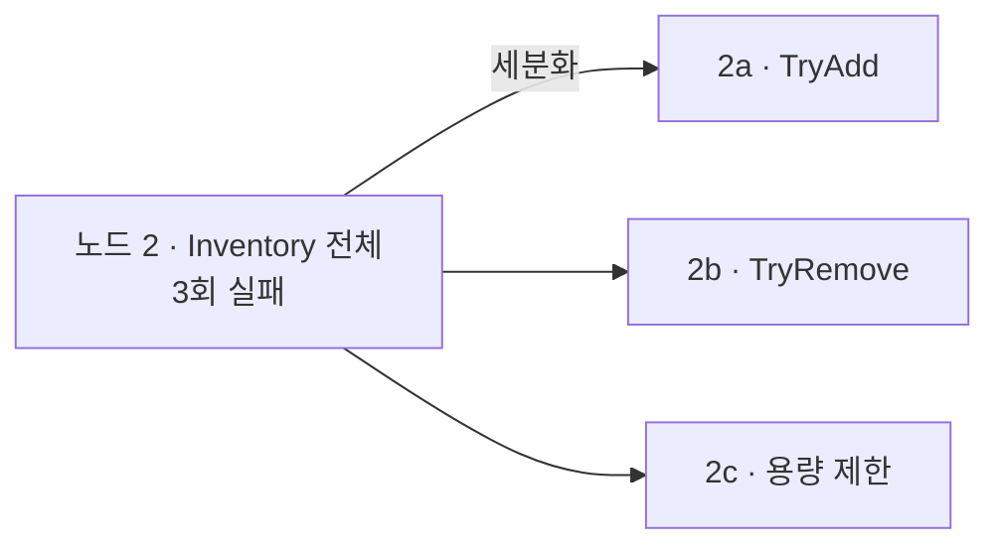

- 초록 노드는 **절대 건드리지 않는다**(§3.2 동결)
- 노드 크기가 **단조 감소**하므로 유한 스텝에 수렴한다
- 세분화가 곧 Span 트리에 자식을 다는 것 — **분해 트리 = 트레이스 트리**

**쪼개기로 안 되는 경우가 있다.** 경계 자체가 틀렸다면(결합이 너무 강해 사실 한 노드여야 했다면)
더 쪼개도 해결되지 않는다. → N회 후 **경계 재설계**로 승격하되 횟수를 제한하고,
그것도 소진되면 **사람에게 보고한다.** 조용히 발산하느니 멈추고 말하는 게 낫다.

### 2.5 재분해에 되먹이는 것

에러 문자열이 아니라 **트레이스 요약**이다.

> `노드 2(Inventory)` 가 3회 실패했고, 그중 2회는 `Assets/Scripts/Quest/` 를 쓰려다
> 소유권 위반으로 반려됐습니다. 이 노드는 퀘스트 쪽 타입에 의존하고 있습니다.

평평한 로그로는 이런 요약을 만들 수 없다 — §6.3 참조.

---

## 3. 작업 층 — 노드 하나

### 3.1 왜 쪼개는 것이 "효율"인가

히스토리 윈도우·피드백 상한으로 씨름한 건 결국 *한 번에 너무 많이 만든다* 는 문제였다.

| | 통째로 생성 | 노드 단위 |
|---|---|---|
| 실패 귀속 | "어딘가 틀렸다" | **이 작은 변경이 틀렸다** |
| 스텝당 컨텍스트 | 전체 파일 × 전부 | 해당 노드 + 계약뿐 |
| 초록인 부분 | 매 스텝 재생성 | **동결 — 다시 만들지 않는다** |

### 3.2 동결과 소유권

세 번째가 특히 크다. **[현재]** 스텝 3에서 모델이 스텝 1의 멀쩡한 파일을 다시 뱉는다.
**[계획]** 노드가 초록이 되면 그 파일은 이후 노드에게 **읽기 전용**이 된다.

각 노드는 자기가 쓸 경로를 선언하고, `Apply` 노드가 강제한다.

```
{ "id": "quest",
  "owns":  ["Assets/Scripts/Quest/**", "Assets/Tests/PlayMode/Quest*"],
  "reads": ["Assets/Scripts/Contracts/**"] }
```

- 소유 밖 파일을 쓰려 하면 → `Fail`(모델 잘못이므로 피드백으로 고칠 수 있다)
- 노드 간 소유권이 겹치면 → 시작 자체를 거부한다(나중에 터지느니 지금) — **[계획]**, 지금은 노드가 하나다

**[현재]** 쓰기 검사는 강제된다. [`Ownership`](../Orchestrator/Loop/Ownership.cs) + `ApplyNode`
(`--owns <glob,glob>`). `ApplyAsync` **전에** 돈다 — 쓴 다음에 잡으면 이웃의 파일은 이미 사라졌다.

예상해서 만든 게 아니라 **보호 없는 경우를 측정해서** 만들었다(§8.3): 굶은 노드가 `Actor` 와
`DungeonGrid` 를 다시 쓰고, 그래서 깨진 테스트까지 다시 쓰고, 루프는 성공을 보고했다.
같은 굶은 조건에 소유권만 선언해 다시 돌리자 **현장에서 잡혔다**:

```
②-a owns   → 2 path(s) outside ownership ❌
      · Assets/Scripts/Core/Actor.cs
      · Assets/Scripts/Core/DungeonGrid.cs
❌ FAILED — gave up after 4 step(s) — still failing
```

`Actor.cs`·`DungeonGrid.cs` 와 그 테스트 18개가 `seed`·`TileType` 까지 그대로 살아남았다.
실행은 실패했다 — **맞게** 실패했다. **여기서 목표는 정직한 실패다. 대안은 삭제된 계약을 내보내면서
성공이라고 말하는 것이었다.** 같은 결핍이 이제 두 결말이 아니라 하나를 낸다.

**소유권은 추론이 아니라 선언이다.** 기본값이 그 이유를 증명한다 — 데모 5종이 쓰는 파일들이
(`Assets/Scripts/DemoHealth.cs` 등) 이미 이 레포에 있어서, "기존 파일 전면 보호"를 기본값으로 하면
§11 1단계의 회귀 기준이 그대로 깨진다. `owns[]` 를 만들 계획 레이어(§2.1)가 없으니 CLI 가 선언하고,
선언이 없으면 강제하지 않는 대신 **어떤 기존 파일을 고쳤는지 기록한다** — 앞선 파괴가 git diff 로만
발견됐으므로 보이게 하는 것이 최저선이다.

강제가 판정을 바꾸지 않는다는 것도 확인했다. 깨끗한 베이스라인에서 설정별 `--demo` 3회:
`--owns` 없이 2·1·2, `--owns` 있이 1·2·1. **양쪽이 두 결과를 다 낸다** — 1스텝은 §10 에 이미 적어 둔
낡은 어셈블리 오탐이고 이 변경의 회귀가 아니다. 1회로 판정했으면 오진했을 것이다.

소유권이 **못** 덮는 것: 노드가 정당하게 소유한 파일 **안에서** 멤버를 삭제하는 경우.
그게 §8.3 의 표면 회귀 게이트다 — **[현재]**. 별도 변경으로 넣은 건 데모가 깨졌을 때 어느 쪽 탓인지
가릴 수 있게 하려는 것이다.

이 기계가 그대로 멀티세션에서 재사용된다(§7.3).

---

## 4. TDD 사이클 — 한 노드를 초록으로

### 4.1 정적 타입에서의 RED — 스켈레톤이 필요하다

C#에서 "테스트 먼저"는 **컴파일되지 않는다.** 존재하지 않는 타입을 참조하기 때문이다.
그래서 RED 단계의 산출물은 `테스트`가 아니라 **`스켈레톤 + 테스트`** 다.

```csharp
// 스켈레톤 = 계약. 컴파일은 되지만 아직 아무것도 안 한다.
public sealed class Inventory
{
    public bool TryAdd(ItemId id, int count) => throw new NotImplementedException();
}
```

**이 스켈레톤이 곧 계약이다.** TDD 를 하면 계약 우선이 공짜로 따라온다 —
다른 노드/세션은 구현이 없어도 이 스켈레톤에 기대어 자기 테스트를 쓸 수 있다.
**테스트는 실행 가능한 명세다.**

### 4.2 RED 게이트 — 헛통과하는 테스트를 잡는다

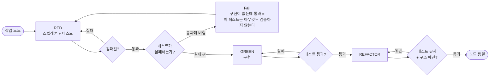

가운데 `RT` 가 이 절의 전부다. **[현재] 루프의 최대 약점은 모델이 테스트와 구현을 둘 다 쓴다는 것**이다.
자기 시험을 자기가 채점한다. 그래서 피드백에 *"테스트를 느슨하게 고쳐 통과시키지 마세요"* 라고
못을 박아 뒀는데, 그건 사실 문제가 있다는 **자백**이다.

RED 게이트는 이걸 구조로 막는다 — **구현 없이 통과하는 테스트는 헛것이다.**

> 발명이 아니다. 터치 입력을 검증할 때 손으로 한 것과 같다 — 프레임을 안 넘기고 읽으면
> `Expected: Began / But was: None` 으로 **실패하는지**부터 확인했다.
> 그때는 사람이 했고, 이제 노드가 한다. ([WORKLOG](WORKLOG.md))

### 4.3 REFACTOR — 판정 기준이 없으면 무작위 변경이다

Red→Green 은 검증된다. 그런데 *"SOLID 하게, 응집도 높게 고친다"* 는 무엇으로 판정하나?
**테스트가 초록인 건 망가뜨리지 않았다는 뜻일 뿐, 좋아졌다는 뜻이 아니다.**

이 프로젝트의 답은 정해져 있다 — **재서 예산으로 만든다.**
시간 예산 → 렌더 예산 → **구조 예산**.

| 지표 | 잡으려는 것 | 비용 |
|---|---|---|
| 파일·메서드 길이 | 비대한 책임 | 싸다 |
| 타입당 public 표면 | 캡슐화 붕괴 | 싸다 |
| 구현체가 1개뿐인 인터페이스 | **과도한 추상화** | 싸다 |
| 타입 간 의존 방향 · 순환 | 결합도 | 중간(참조 그래프) |

기존 스킬 `CHECKS` 기계(`Skills/`, `CSharpSource`)를 **예산으로 승격**하는 것이라 새 인프라가 아니다.

### 4.4 지표는 양방향이어야 한다

"추상화가 늘면 좋다"고 보상하면 모델은 20줄짜리 클래스에 인터페이스 3개와 팩토리를 붙인다.
LLM 의 알려진 실패 모드다. 그래서 구조 예산은 응집도를 올리되 **간접 계층은 늘리지 않는다.**
`구현체 1개뿐인 인터페이스`, `위임만 하는 래퍼` 같은 YAGNI 신호를 위반으로 잡는다.

단, 스킬 원칙을 지킨다 — *"이론상 나쁜 것이 아니라 **모델이 실제로 하는 실수**를 겨냥하고,
기존 산출물로 오탐부터 확인."* 구조 지표도 **과거 산출물에 먼저 돌려 보고** 채택한다.

### 4.5 비용 — EditMode 를 우선한다

RED 게이트는 검증 사이클을 하나 더 쓴다. 멀티세션에서는 에디터 리스 경합이 늘어난다.

완화책: **순수 로직은 EditMode 테스트로 돌린다.** 플레이모드 진입도 도메인 리로드 대기도 없다.
프레임·입력·코루틴이 필요한 것만 PlayMode 로 남긴다.
**[현재]** 우리 테스트는 전부 PlayMode(`Assets/Tests/PlayMode/`)라 상당수가 내려갈 수 있다.
**[미실측]** 얼마나 빨라지는지.

---

## 5. 실행 그래프 — 한 단계

### 5.1 그래프

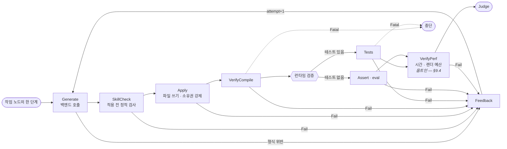

**[현재]** 이 흐름은 이미 동작한다. 다만 [`AgentLoop.RunAsync`](../Orchestrator/Loop/AgentLoop.cs) 안에
`for` + `if` + `continue` 로 **하드코딩**돼 있다. 아래는 그것을 데이터로 끌어낸 것이다.

### 5.2 노드 계약

```csharp
public interface INode
{
    string Name { get; }
    Task<NodeOutcome> RunAsync(RunContext ctx, CancellationToken ct);
}

public sealed record NodePolicy(
    int       MaxRetries   = 0,      // 노드 자체 재시도(모델 재호출 아님)
    TimeSpan? Timeout      = null,
    bool      FatalOnError = false); // 예외를 Fatal 로 볼지 Fail 로 볼지
```

노드는 **자기 판단만** 한다. 라우팅·재시도·타이밍·기록은 전부 실행기가 소유한다.
노드가 `continue` 를 부르지 않는다는 게 핵심이다 — 흐름 제어가 노드 밖으로 나오면서
"검증을 하나 추가한다"가 *수술*에서 *등록*으로 바뀐다.

**[현재]** `EvalWithRetryAsync`(도메인 리로드 직후 1회 재시도), 플레이모드 ready 게이팅,
`recompile_status` 폴링 — 전부 손으로 짠 재시도다. 정책으로 올리면 노드마다 다시 짜지 않는다.

### 5.3 NodeOutcome — 다섯 갈래

| 결과 | 누구 잘못인가 | 라우팅 |
|---|---|---|
| `Pass` | — | 다음 노드 |
| `Fail` | **모델.** 고칠 수 있다 | 피드백 → 재생성 |
| `Skip` | — (기준 없음 / 타깃 미지원) | 다음 노드 (통과로 친다) |
| `Blocked` | **다른 세션.** 내 코드는 멀쩡하다 | 대기 후 재시도 (§7.5) |
| `Fatal` | **인프라.** 모델이 고칠 수 없다 | 즉시 중단 |

**가운데 열이 이 표의 전부다.** 결과 갈래는 "무엇이 일어났는가"가 아니라
**"누구 잘못인가"** 로 나뉜다. 귀책이 라우팅을 결정하기 때문이다 — 모델 잘못만 모델에게 되돌린다.

`Fail`/`Fatal` 분리는 비싸게 얻었다. 리컴파일 직후 플레이모드 진입 거부를
*"네 코드가 틀렸다"* 로 되먹여 멀쩡한 코드를 재생성하며 스텝을 낭비한 적이 있다.
**[현재]** 예외를 던져 암묵적으로 지키지만, 그래프에서는 **노드 정책으로 명시**된다.

`Skip` 은 성공 출구를 하나로 만든다. **[현재]** "기준 없음 → 즉시 성공 return" 이
[세 군데](../Orchestrator/Loop/AgentLoop.cs) 흩어져 있다(142·176·187행).
판정은 파이프라인 끝에서 한 번만 해야 한다.

### 5.4 자원 리스 — 정직한 병렬성

**에디터는 배타 자원이다.** Tests 도 Perf 도 플레이모드에 들어가야 해서 동시에 못 돈다.
"검증을 병렬화한다"는 이 타깃에서 **성립하지 않는다.**

진짜 병렬이 가능한 곳은 **생성**이다. 느린 건 검증(수십 초)이 아니라 모델 호출(수 분)이다.

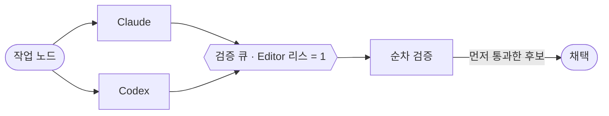

**[계획]** best-of-N. 이미 증명한 agent-agnostic 위에 그대로 얹힌다 —
*"두 에이전트가 같은 루프를 돈다"* 에서 *"두 에이전트를 경쟁시키고 검증이 심판한다"* 로.

### 5.5 검증 노드가 실제로 하는 통신

**[현재]** 실측으로 확정된 순서다. 특히 **폴링과 ready 게이팅**은 없으면 반드시 깨진다.

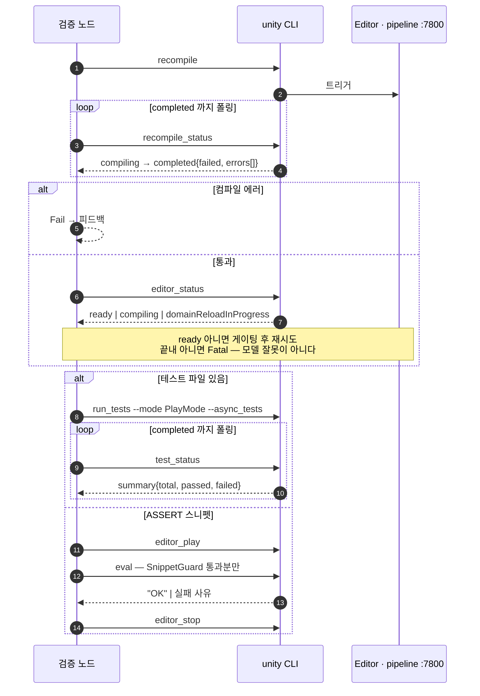

폴링이 두 번 나오는 게 우연이 아니다. **PlayMode 테스트는 동기 실행이 불가능**하고,
**리컴파일 직후에는 플레이모드 진입이 조용히 거부**된다. 둘 다 실측으로 알아낸 제약이라,
그래프에서는 노드 안 임시방편이 아니라 **정책(재시도·타임아웃)** 으로 표현한다.

---

## 6. 트레이스 — 모든 층을 묶는 척추

### 6.1 평평하지 않다, 트리다

계획 · 작업 · TDD · 실행이 **하나의 트레이스 트리**로 묶인다.
따로 기록하면 "이 실패가 어느 작업의 어느 단계에서 왔나"를 잃는다.

```csharp
public sealed record Span(
    string   RunId,
    string   SpanId,
    string?  ParentSpanId,     // ← 이 한 줄이 트리를 만든다
    SpanKind Kind,             // Work | Phase | Node | Lease
    string   Name,             // "Inventory.TryAdd" | "RED" | "VerifyCompile" | "editor"
    string?  SessionId,        // 멀티세션에서 누가 (§7)
    Outcome  Outcome,          // Pass | Fail | Skip | Blocked | Fatal
    string?  BlamedOn,         // Blocked 일 때 누구 때문인지
    double   Ms,
    IReadOnlyList<string> Errors,
    IReadOnlyList<string> Artifacts);
```

실행기가 발행한다(노드가 아니라). 텍스트 로그로는 학습이 안 된다 — **튜플이어야 한다.**
`Kind` 가 네 종류인 게 우연이 아니다: 세 실행 층 + **리스**(§7.4). 대기도 1급 기록 대상이다.

### 6.2 한 실행의 트리

**[현재]** `agentloop --demo-perf --trace` 의 실제 출력. `Work`·`RED/GREEN`·`Lease` 층은 아직
채워지지 않아(§11 3·5단계) 지금은 `Run → step → node` 다:

```
run 20260817-004257  "A ScoreTracker component; Record(int) may be called every fr…"  ✅ 2 step(s), 66.7s
  backend scripted:demo · target unity:6000.5.4f1 · skills client-architecture,unity-performance,unity-pitfalls
A ScoreTracker component; Record(int) may be called… ✅   66.7s  behavior AND performance verified in 2 step(s)
├─ phase step 1                                      ✅   34.1s
│  ├─ Generate                                       ✅     9ms  1 file edit(s)  → spans/s003/reply.txt
│  ├─ SkillCheck                                     ✅     7ms  9 checks
│  ├─ Apply                                          ✅   561ms  applied 1 file(s), recompile triggered
│  ├─ VerifyCompile                                  ✅    1.9s
│  ├─ VerifyAssert                                   ✅   19.4s  AI-written
│  └─ VerifyPerf                                     ❌   12.0s  50000 calls in 50.27ms  [1 error(s)]
└─ phase step 2
   ├─ …
   └─ VerifyPerf                                     ✅   12.2s  50000 calls in 14.31ms
```

**[계획]** 분해와 TDD 사이클이 들어오면 같은 트리에 바깥 층이 붙는다:

```
run …                                                                ✅ 6m12s
├─ work  계약 · ItemId / IInventory                                   ✅ 1m03s
│  ├─ RED    스켈레톤 + 테스트                                        ✅ 41s
│  │  ├─ Generate · Apply · VerifyCompile                             ✅
│  │  └─ RedGate         테스트가 실패하는가                          ✅ 3s
│  └─ GREEN                                                          ✅ 22s
├─ work  Inventory.TryAdd                                            ✅ 2m28s
│  ├─ RED    (2회)
│  │  └─ RedGate         Fail — 구현이 없는데 통과함(헛테스트)
│  └─ REFACTOR  구조 예산  public 표면 7→3                            ✅
└─ work  보상 지급 연동
   └─ lease  editor      대기 1m14s  ← 세션 B 보유                    ⏳
```

이 트리 하나로 답이 나오는 것들:

| 질문 | 어디서 |
|---|---|
| 어느 **작업**이 제일 헤맸나 | Work span 재시도 → **분해 품질**(§2.2) |
| 모델이 어떤 **헛테스트**를 쓰나 | RedGate `Fail` 누적 → Distiller(§9.2) |
| 멀티세션 병목이 진짜 있나 | Lease span 대기 시간 → §7 설계 검증 |
| 남 때문에 막힌 시간 | `Blocked` + `BlamedOn` 집계 |
| 어디서부터 재개하나 | 마지막 `Pass` span |
| 예산을 얼마로 잡아야 하나 | 측정 span 분포 → Calibrator(§9.1) |

**결과 갈래를 "누구 잘못인가"로 나눈 것(§5.3)이 여기서 회수된다.** 모든 span 이 귀책을 들고 있어서,
집계하면 *"모델 잘못 4건, 남 때문에 막힘 1m14s, 인프라 0건"* 이 그냥 나온다.

### 6.3 왜 트리가 아니면 안 되는가

평평한 이벤트 목록으로도 로그는 남는다. 하지만 **학습이 안 된다.**
"이 컴파일 에러"가 *어느 작업 노드의 RED 단계에서 몇 번째 시도인지* 를 모르면,
그건 그냥 에러 문자열이지 학습 신호가 아니다. 재분해 피드백(§2.5)도 만들 수 없다.

**`ParentSpanId` 한 줄이 로그를 데이터셋으로 바꾼다.**

### 6.4 RunStore

**[현재]** 모든 실행이 프로젝트의 `.agentloop/runs/` 아래 기록된다(gitignore).
예전엔 `%TEMP%` 로 갔다 — *"모델이 무엇을 틀렸고 무엇으로 고쳐서 통과했는가"* 라는
제일 구하기 힘든 데이터를 만들어 놓고 OS 가 지우게 두고 있었다.

```
.agentloop/runs/<runId>/
  run.json          # 목표·백엔드·타깃·옵션 스냅샷·판정·벽시계
  trace.jsonl       # Span 스트림 (append-only, ParentSpanId 로 트리 복원)
  spans/<spanId>/   # 큰 산출물은 span 에 매달아 둔다
    reply.txt · compile.log · runtime.log
  evidence/*.png
```

```bash
agentloop --demo --trace     # 실행이 끝나면 span 트리를 출력
agentloop --show-trace       # 가장 최근 실행의 트리를 다시 세워 출력
```

- `run.json` 이 **그때의 스킬·예산까지 스냅샷**한다. 안 그러면 나중에 비교가 무의미해진다.
- `trace.jsonl` 은 **추가 전용**이다. 실행 중 죽어도 거기까지가 남고 트리를 복원할 수 있다.
- 비밀은 저장하지 않는다. UGS 경로에서도 키 *이름*만 기록하는 현재 규칙을 유지한다.
- 포폴용으로 남길 실행은 `docs/evidence/` 로 승격한다(작업 데이터와 증거를 섞지 않는다).

---

## 7. 멀티세션 — 한 에디터, 여러 세션

실제 개발은 기능 하나로 끝나지 않는다. 퀘스트와 인벤토리를 동시에 만들고, 관련 에디터 툴도 같이 만든다.
그런데 **퀘스트는 인벤토리에 결합돼 있다** — 보상으로 아이템을 주고, 획득 여부로 조건이 풀린다.

세션을 여럿 띄워 동시에 돌리면 한쪽이 멈춘다. 왜 멈추는지부터 정확히 봐야 한다.

### 7.1 실제로 충돌하는 것

| 충돌 지점 | 이유 | 증상 |
|---|---|---|
| **컴파일 도메인** | `Assets/` 는 하나, 리컴파일은 전역 | **남이 낸 에러가 내 모델 피드백으로 들어간다** |
| **도메인 리로드** | 리로드가 진행 중인 명령을 무효화 | `eval`·`test_status` 타임아웃 = "멈춘다" |
| **플레이모드** | 배타 자원 | `editor_play` 가 조용히 거부됨 |
| **파일** | 같은 파일 동시 편집 | 마지막 쓰기가 이김, 앞의 작업이 사라짐 |

제일 위험한 건 첫 줄이다. 세션 A가 깨진 코드를 쓰면 세션 B의 컴파일 검증도 실패하고,
**B의 모델이 자기가 쓰지도 않은 코드의 에러를 받아 멀쩡한 파일을 재생성한다.**
인프라 실패를 되먹여 스텝을 낭비했던 것과 같은 부류인데, 이번엔 원인이 "남"이다.
→ 그래서 §5.3 에 `Blocked` 가 있다.

### 7.2 세션 그래프 — 계약을 먼저 잠근다

결합된 컨텐츠를 병렬로 만들 때의 진짜 문제는 에디터가 아니라 **합의**다.
두 세션이 각자 `IInventory` 를 발명하면 합쳐지지 않는다. 그리고 **에이전트는 서로 협상할 수 없다.**

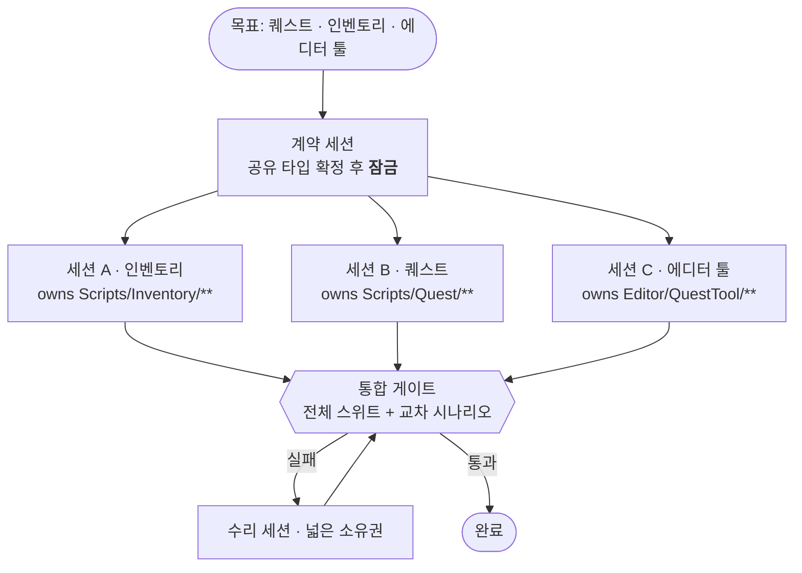

계약 파일은 **아무도 소유하지 않는다**(읽기 전용). 세션이 계약을 고치려 들면 `Fail` 로 반려한다.
"계약이 틀렸다"는 판단은 세션이 아니라 **위층**(§2)이 한다.

**세션 그래프는 작업 그래프(§2)의 분산 버전이다.** 같은 분해를 한 프로세스에서 순차로 돌리면 작업 그래프,
여러 세션에 나눠 주면 세션 그래프다. 그리고 §4.1 의 스켈레톤이 그대로 이 계약 역할을 한다.

### 7.3 소유권

§3.2 의 기계를 그대로 쓴다. 세션 시작 시 소유권이 겹치면 시작을 거부한다.

### 7.4 에디터 리스 — 대기를 "멈춤"이 아니라 "줄서기"로

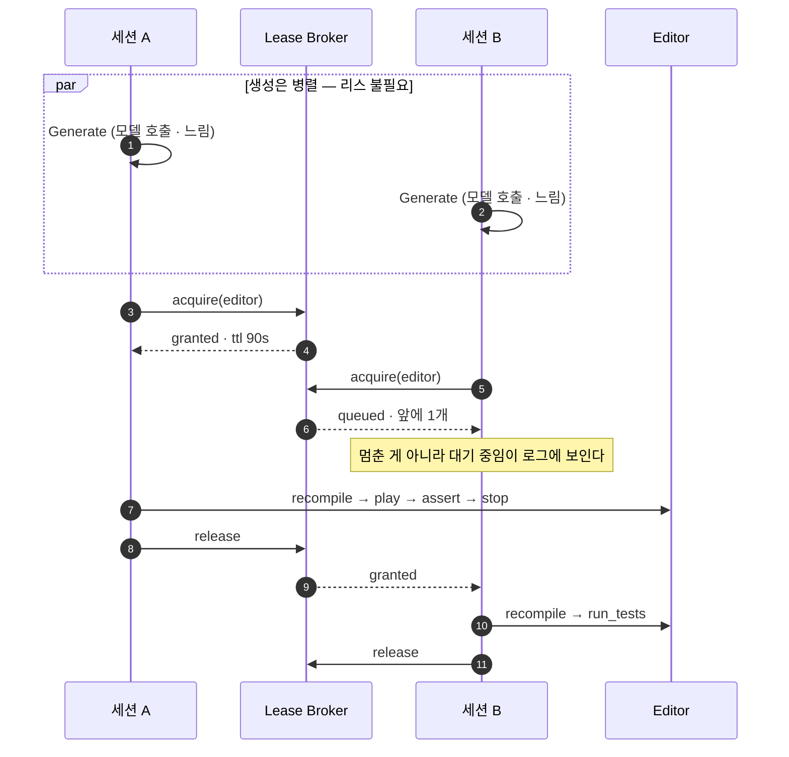

1. **리스 단위는 명령이 아니라 검증 시퀀스 전체**다. `recompile`·`editor_play`·`eval`·`editor_stop` 을
   따로 잠그면 그 틈에 남이 끼어든다.
2. **TTL + 하트비트.** 죽은 세션이 리스를 영원히 쥐면 전원이 멈춘다. 만료되면 회수한다.
3. **대기는 보여야 한다.** `"에디터 리스 대기 중 — 앞에 1개"` 가 찍히면 그건 버그가 아니라 설계다.
   지금 "멈춘다"고 느끼는 것의 절반은 **대기가 안 보여서**다.

생성이 리스 밖이라는 게 핵심이다(§5.4). 검증을 직렬화해도 처리량은 세션 수에 거의 비례해 늘어난다.

### 7.5 신호 귀속 — 남의 에러를 내 잘못으로 삼지 않는다

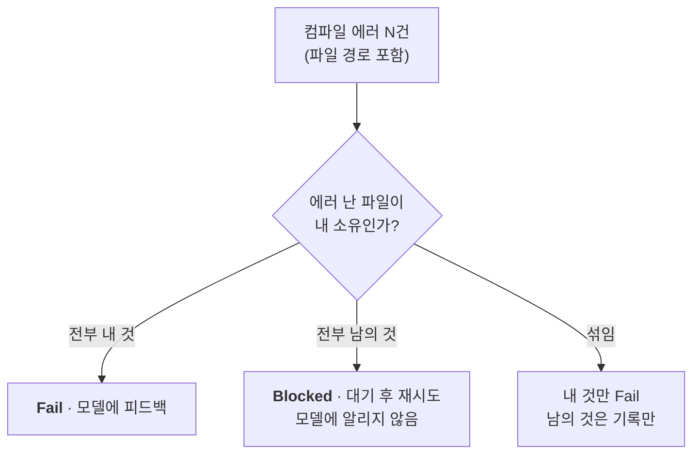

- **컴파일**: `recompile_status` 의 에러가 파일 경로를 주므로 소유권으로 가른다.
- **테스트**: `run_tests --filter` 로 내 어셈블리·네임스페이스만 돌린다(**[현재]** 있는 기능).
- **성능/렌더**: 측정이 전역이라 다른 세션의 플레이모드와 겹치면 오염된다 → **리스 안에서만** 측정한다.

`Blocked` 에는 백오프 상한이 필요하다. 무한 대기 대신 N회 후 "세션 X 때문에 진행 불가"로 보고한다.
**교착을 조용히 견디지 말고 드러내야 한다.**

### 7.6 통합 게이트

각자 초록이어도 합쳐서 도는지는 별개다. *"퀘스트 보상이 실제로 인벤토리에 들어가는가"* 는
어느 세션도 혼자 검증할 수 없다. 전 세션 통과 후 **전체 스위트 + 교차 시나리오 테스트**를 돌린다.

통합 실패는 **어느 한 세션의 잘못이 아니다.** 양쪽을 다 소유하는 수리 세션이 받는다.

### 7.7 격리(worktree)는 왜 답이 아닌가

세션마다 프로젝트 사본 + 전용 에디터를 주면 리스도 신호 오염도 사라진다(`unity --project-path`).
하지만 **결합된 컨텐츠에는 안 맞는다.** 퀘스트↔인벤토리 연동은 정의상 함께 있어야 검증된다.
격리는 *독립적인* 작업에서만 이득이고, 실제 문제는 *결합된* 작업이다. 비용도 싸지 않다(`Library/` 재임포트).

→ **판단: 공유 에디터 + 리스 + 귀속 + 계약 우선.** 격리는 독립 기능을 대량으로 돌릴 때의 선택지로 남긴다.

### 7.8 리스 경합을 줄이는 최적화

검증 중 제일 잦은 건 컴파일이다. Unity 는 IDE 용 `.csproj` 를 생성하므로
**리스 없이** 외부에서 먼저 컴파일해 볼 수 있다.

```
빠른 사전 검사 (리스 X · .csproj)  →  대부분의 문법 오류를 여기서 반려
        ↓ 통과한 것만
권위 있는 검사 (리스 O · 에디터 recompile)
```

**[미실측]** Unity 의 컴파일은 define 심볼·asmdef·컴파일러 설정이 달라 `.csproj` 결과가
에디터와 일치한다는 보장이 없다. **일치율을 먼저 재고**, 어긋나면 사전 검사는
"반려"가 아니라 "힌트"로만 써야 한다.

---

## 8. 하나의 프로젝트 — 시간이 지나도 썩지 않게

에디터도 프로젝트도 결국 **하나로 귀결된다.** 기능을 여럿 동시에 만들 수는 있어도
산출물은 한 코드베이스에 쌓인다. §7 이 *공간적* 공유라면, 이 절은 *시간축* 문제다.

### 8.1 문제 — 이유가 코드에 남지 않는다

인벤토리를 만드는 중이다. 퀘스트가 *"아이템을 갖고 있는지"* 를 물어야 하는데 그 API 가 없다.
퀘스트 쪽이 `Inventory.HasItem()` 을 추가한다. 그다음 갈림길이 둘인데 **둘 다 나쁘다.**

| | 무슨 일이 벌어지나 | 결과 |
|---|---|---|
| **삭제** | 인벤토리 담당이 본다 → *"이거 왜 있지? 아무도 안 쓰는데"* | **퀘스트가 깨진다** |
| **방치** | 아무도 못 건드린다 → 정체불명인 채로 남는다 | **개발할수록 쓰레기가 쌓인다** |

근본 원인은 하나다 — **이 코드가 왜 있는지는 *다른 기능의 요구사항*에 있는데, 코드에는 없다.**

사람 팀은 리뷰·`git blame`·*"이거 누가 쓰죠?"* 질문·부족 지식으로 메운다.
**에이전트에게는 그게 하나도 없다.** 자기 슬라이스만 본다.

### 8.2 소비자 주도 계약 — 요구를 1급 자산으로

소유권(§3.2) 때문에 퀘스트는 인벤토리 파일을 **못 고친다.** 대신 **요청한다.**

```
Contracts/inventory.contract.json
  { "member":       "IInventory.HasItem(ItemId) -> bool",
    "requestedBy":  "quest.reward-condition",
    "why":          "퀘스트 조건이 아이템 보유 여부로 판정된다",
    "consumerTest": "QuestTests.Condition_Clears_When_Item_Held" }
```

- 계획 층(§2)이 이 요청을 **작업 노드**로 만든다 — *"인벤토리: 퀘스트 계약 충족"*
- 구현은 **인벤토리 소유자**가 한다. 경계는 그대로다
- **계약이 "누가·왜"를 기록한다.** 코드가 못 하던 일이다

`consumerTest` 가 집행자다. 인벤토리가 그 멤버를 지우면 **퀘스트의 테스트가 깨지고**
통합 게이트(§7.6)에서 잡힌다. 소비자 주도 계약 테스트가 하는 일 그대로다.

### 8.3 삭제 게이트 — 문제를 뒤집는다

계약이 있으면 *"지워도 되나?"* 가 **기계적으로 판정된다.**

| 내부 사용처 | 계약 | 판정 |
|---|---|---|
| 있음 | — | 유지 |
| 없음 | **있음** | **유지** — 남이 필요로 한다. 지우려면 계약부터 |
| 없음 | 없음 | **고아 — 제거 대상** |

세 번째 줄이 핵심이다. **"쓰레기가 쌓인다"가 "자동으로 찾아 지운다"로 뒤집힌다.**
살아 있는 코드가 계약으로 정당화되므로, 정당화되지 않은 것이 곧바로 드러난다.

삭제 시도는 §5.3 의 갈래로 처리된다 — 계약에 있는 멤버를 지우려 하면 `Fail`:

> 이 멤버는 `quest.reward-condition` 의 계약 항목입니다. 지우려면 계약부터 바꿔야 하고,
> 그 판단은 계획 층이 합니다.

§7.2 와 같은 규칙이다 — **계약이 틀렸다는 판단은 소비자도 소유자도 아닌 위층이 한다.**

**[현재] 이건 미래의 걱정이 아니다 — 보호 없는 실행이 이미 계약을 파괴하고 루프는 성공이라고 말했다.**
`Sample/Roguelike` 슬라이스 3을 `--no-surface` 로 돌린 실측이다(다른 실행에서는 같은 목표가 4스텝에 정직하게 실패했다):

| | 실행 전 커밋 상태 | 실행 후 |
|---|---|---|
| `Actor` | name·MaxHealth·CurrentHealth·IsAlive·TakeDamage·Heal·MoveTo·`Died` 이벤트·죽음 래치 | **X·Y·IsDead·SetPosition·Kill** |
| `DungeonGrid` | `TileType` enum·`(w, h, seed)`·`TileAt`·`IsWalkable` | **enum 삭제·seed 삭제·`TileAt` 삭제·`SetWalkable` 추가** |
| 테스트 수 | 18 | **9** |

출력된 판정: `✅ SUCCESS — applied and runtime-verified in 4 step(s)`, `19/19 tests passed`.

메커니즘을 정확히 적어 둘 값이 있다. 게임 코드의 구멍이 아니라 **검증의 구멍**이다:

1. `Actor`/`DungeonGrid` 를 해석할 수 없으니(`reads` 없음, §2.2) 모델이 그쪽에 맞추는 대신
   **자기 가정에 맞게 그것들을 다시 정의했다.**
2. 그러면 기존 테스트가 깨지므로 **테스트까지 다시 썼다.**
3. 전부 컴파일되고 남은 테스트가 전부 통과하니 루프는 성공을 선언했다.

**"모든 테스트 통과"는 모델이 편집한 뒤 존재하는 테스트를 기준으로 측정된다.** 모델이 코드와 테스트를
둘 다 쓰므로 계약을 축소하면 언제든 초록에 도달한다. 스위트로는 못 잡는다 — 다시 쓰인 게 스위트다.
`git` 만이 잡았고, 그것도 테스트 수를 비교했기 때문이다. `seed` 가 사라진 건 슬라이스 1의 결정성
보장이 조용히 삭제된 것이다.

결론 둘:

- **이게 위험한 방향의 오류다.** 오탐 실패는 스텝 하나를 태우지만, 오탐 통과는 성공이라고 보고하면서
  회귀를 내보낸다 — §10 의 낡은 어셈블리 이상현상에 적어 둔 것과 같은 비대칭이다.
- **프롬프트 금지는 강제가 아니다.** 목표에 *"Do NOT modify DungeonGrid or Actor - use the members they
  already expose."* 가 그대로 있었는데 무시됐다. §3.2 의 `owns[]` 가 `[계획]` 이라 `ApplyNode` 는
  노드가 프로젝트의 어느 파일이든 덮어쓰게 둔다. `reads` 를 준 것(§2.2)은 결핍을 고치지만 이 구멍은
  **닫지 않는다** — 표면을 준 두 실행에서 계약이 살아남은 건 두 번의 관측이고 보장이 아니다.

**[현재] 게이트를 만들었다** — [`SurfaceDiff`](../Orchestrator/Targets/SurfaceDiff.cs) +
`DeletionGateNode`(`--deletion-gate`). Apply 뒤 · 컴파일 앞에 돈다: 표면은 소스에서 읽으므로 기다릴 게
없고, 싼 검사가 앞에 오는 게 맞다(§5.1). 경로 전면 보호보다 좁다 — 이웃을 정당하게 **확장**하는 노드는
통과하고, **사라진 것**만 실패한다.

설계 결정 둘, 취향이 아니라 측정이 강제했다:

- **멤버 키는 전체 시그니처가 아니라 이름 + 인자 수다.** 시그니처로 잡으면 파라미터 개명
  (`int amount` → `int damage`)이 삭제로 보여 정당한 작업을 막는다. 이름+arity 는 삭제와 arity 변경은
  잡는다. `<>`·중첩 괄호 안의 쉼표는 세지 않는다 — 안 그러면 `Dictionary<int,string> m` 이 인자 2개가 된다.
- **기준선에 테스트 폴더를 포함한다**(프롬프트 다이제스트와 다르다). 첫 버전은 런타임만 읽어
  `ActorTests` 가 10개 → 8개로 줄어든 걸 놓쳤다 — 멤버를 지운 뒤 스위트를 초록으로 만드는 수단이 정확히
  그것이다. 테스트를 지키지 않는 코드 보호는 아무것도 보호하지 않는다.

public 멤버 2개와 그 테스트를 지우라고 시켜 실측:

```
②-b deletion → 9 public member(s) disappeared ❌
      · Roguelike.Core.Actor.Died(0 arg)   · Roguelike.Core.Actor.Heal(1 arg)
      · ActorTests.Heal_Increases_Health(0 arg)  · ActorTests.Died_Event_Raised_… (외 4)
②-b gate     → surface intact ✅  (7 type(s) checked)
③ verify   → Test Runner passed ✅  27/27 tests passed
```

피드백이 수리를 만들었다 — **이름으로** 무엇이 사라졌는지 되돌려 받으니 모델이 9개를 전부 되살렸다.
§2.2 의 `CS0246` 대 `CS7036` 과 같은 구조다: 사라진 것을 **이름 대는** 메시지는 수렴하고,
없다고만 하는 메시지는 수렴하지 않는다.

오탐은 데모 5종에 게이트를 켜서 확인했다 — **발동 0**, 다섯 개 모두 문서화된 판정(각 2스텝)을 유지했다.
§11 1단계 회귀 기준은 지켜진다. 그럼에도 opt-in 으로 두는 이유는, 결정적 실행 5개에서 안전이 보였을
뿐 벤치마크로는 아직 안 봤기 때문이다.

**게이트 탓이 아닌 한계도 같이 드러났다.** 그 테스트의 목표는 `Heal` 과 `Died` 를 제거하라는 것이었다.
게이트가 거부하고, 모델이 되살리고, 그러자 전부 통과해 루프는 `✅ SUCCESS` 를 찍었다 —
**일어나지 않은 작업에 대해.** **루프의 성공 기준은 "검증 노드가 전부 통과"이지 "목표가 달성됨"이 아니다.**
§8.3 의 라우팅대로면 거부된 삭제는 **위로**, 계획 레이어에 "계약을 먼저 바꿔라"로 올라가야 한다.
계획 레이어가 없으니(§11 5단계) 거짓 성공으로 막힌다. §2.1 의 `doneCriterion` 이 필요하다는 가장 분명한
근거다 — 기준이 없는 노드는 "끝났다"와 "포기하고 게이트를 통과했다"를 구별할 수 없다.

### 8.4 asmdef — 컴파일러가 강제하게 한다

오케스트레이터의 경로 검사는 *우리 코드가* 지키는 규칙이다. 그런데 **Unity 는 더 강한 걸 준다.**

```
Assets/Scripts/Contracts/   Game.Contracts.asmdef   (아무것도 참조 안 함 · leaf)
Assets/Scripts/Inventory/   Game.Inventory.asmdef  → Contracts
Assets/Scripts/Quest/       Game.Quest.asmdef      → Contracts, Inventory
Assets/Editor/QuestTool/    Game.QuestTool.asmdef  → Quest  (Editor 전용)
```

- 참조 방향이 **컴파일러로 강제**된다. 퀘스트가 인벤토리 내부를 몰래 쓰는 게 불가능해진다
- **순환 의존은 Unity 가 애초에 거부한다** — §2.3 의 정적 검사 하나가 공짜로 따라온다
- 어셈블리가 쪼개지면 **부분 컴파일**이 되어 §7 의 리스 점유 시간도 줄어든다

**[현재]** 우리는 이미 `AgentLoop.Runtime.asmdef` / `AgentLoop.Tests.asmdef` 로 이 기계를 쓴다.
기능별 asmdef 은 그 확장일 뿐이다. **[계획]** 작업 노드가 자기 asmdef 을 갖도록 분해(§2.1)에 포함한다.

### 8.5 표면 예산 — 비대해진 모듈은 분해 실패의 증거다

구조 예산(§4.3)에 두 항목을 더한다.

| 지표 | 의미 |
|---|---|
| **고아 public 멤버 수 = 0** | 정당화되지 않은 표면이 없다 |
| **타입당 public 표면 상한** | 넘으면 그 모듈이 너무 많은 역할을 진다 |

두 번째가 바깥 루프(§2.2)와 이어진다 — **인벤토리의 표면이 계속 부푼다면 분해가 틀렸다는 신호다.**
"인벤토리"라는 노드가 사실 두세 개였던 것이다 → 세분화 트리거.

### 8.6 출생 기록은 이미 트레이스에 있다

*"이 멤버가 왜 여기 있나"* 는 §6 의 Span 트리가 이미 안다 —
어느 `Work` span 이 어떤 목표로 그 파일을 건드렸는지가 기록돼 있다.

계약이 **선언된** 이유라면 트레이스는 **실제** 이유다. 둘이 어긋나면 그것도 신호다.

### 8.7 미실측 / 열린 질문

- 계약을 **누가 먼저 쓰나** — 소비자가 요청서를 내나, 계획 층이 예측해 미리 박나?
  전자는 정확하지만 왕복이 늘고, 후자는 빠르지만 틀린 계약을 낳는다.
- 기능별 asmdef 분할이 **컴파일 시간에 실제로 이득인지** (분할이 오히려 늘리는 경우도 있다)
- **고아 판정의 오탐** — 리플렉션·`SendMessage`·인스펙터의 `UnityEvent`·`[MenuItem]` 은
  정적 분석에 안 잡힌다. Unity 특유의 위험이라 **오탐률부터 재야** 삭제를 자동화할 수 있다.

---

## 9. 학습 사이클 — 실행들 사이

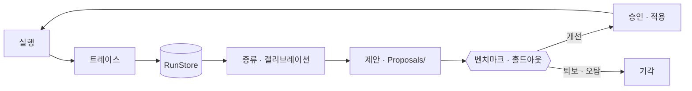

**학습기는 라이브 경로에 직접 쓰지 않는다.** 제안만 낸다. 승격은 벤치마크가 결정하고 사람이 승인한다.
자기개선 루프의 고전적 실패는 **검증기를 속이는 법을 배우는 것**이고,
우리는 이미 그 조짐을 알기에 피드백에 못을 박아 뒀다 —
*"assert 를 느슨하게 바꿔 통과시키지 마세요"*, *"PERF 예산을 늘려서 통과시키지 마세요"*.
스킬이 자동 생성되면 **나쁜 스킬이 품질을 떨어뜨릴 수 있다.** 게이트가 구조적으로 필요하다.

### 9.1 Calibrator — 예산을 데이터에서

**[현재]** `PERF:` 블록의 예산(`maxTotalMs`)은 **모델이 스스로 제안한다.** 자기 시험을 자기가 채점한다.
사람이 정한 값도 손으로 데어 가며 맞췄다 — 12ms 로 잡았다 플래키해서 25ms, 드로우콜 30 → 120.

**[계획]** 측정 분포를 쌓아 `p95 × 마진`으로 예산을 뽑고, 모델 제안값을 **검증·교정**한다.
작고 명확하며, 이미 두 번 겪은 고통을 없앤다.

이건 인라인 루프가 아니라 **최적화 패스(§9.4)에 속한다** — 에디터 측정치로 예산을 캘리브레이션하면
기기 의존적인 숫자에 공식적인 외양만 입히는 꼴이 된다.

### 9.2 Distiller — 실패에서 스킬로

**[현재]** `Skills/*.md` 는 사람이 쓴다. 그런데 스킬 작성 원칙은 이랬다 —
*"이론상 나쁜 것이 아니라 **모델이 실제로 하는 실수**를 겨냥하고, 기존 산출물로 오탐부터 확인."*
**실행 기록 마이닝이 그 원칙의 자동화판이다.**

같은 실패 시그니처가 N회 반복 → `GUIDANCE` 한 줄 + `CHECK` 정규식을 제안한다.
`CHECK` 절반은 **검증 가능**하다는 게 핵심 — 과거 산출물 전체에 돌려 오탐률을 재고, 통과해야 채택.
지식이 마크다운이라 git diff 로 보이고, 사람이 거부할 수 있다.

### 9.3 Policy — 라우팅

백엔드·모델·`--tests-only`·히스토리 윈도우는 **[현재]** 고정 플래그다.
`(목표 부류, 설정) → 수렴 스텝 수`를 쌓으면 라우팅을 학습할 수 있다.
best-of-N(§5.4)과 붙으면 밴딧 문제가 된다 — 이겨 온 백엔드에 생성 예산을 더 준다.

### 9.4 성능은 루프 밖이다

**[현재]** 예산 단계는 기본 검증 사슬에 없고 **옵트인**(`--perf`)이다. 이유가 둘인데 둘 다 실측이다.

**1. 에디터 측정치는 출시 성능이 아니다.** IL2CPP 아닌 Mono, burst 없음, 매니지드 스트리핑 없음,
에디터 루프 오버헤드. *상대* 신호로는 쓸모 있다 — 무할당 4.8ms vs 매 호출 할당 30.2ms,
6배 차이가 안정적으로 재현됐다. 그런데 **같은 코드**가 13.9ms↔11.9ms 로 흔들리기도 했다.
회귀 탐지기이지 예산이 아니다. `maxTotalMs` 라는 이름이 없던 권위를 부여하고 있었다.

**2. 루프 자신의 판정을 오염시키고 있었다.** PERF 스니펫은 `eval` 로 도는데,
PlayMode 테스트 **직후의** `eval` 은 도메인 리로드 창에 걸린다:

```
③ verify → Test Runner passed ✅  7/7 tests passed      ← 코드는 맞았다
③ verify → perf budget ❌  'Health' could not be found  ← 어셈블리가 아직 안 돌아왔다
```

이 인프라 실패가 모델에게 **"네 코드가 틀렸다"로 되먹여졌고**, 모델은 이미 통과한 코드를
다시 만드느라 한 스텝을 썼다. 벤치 목표 **2개 중 2개**에서 재현돼 중단시켰다 — 노이즈가 아니라 계통 오차다.
§5.3 이 경고한 `Fail`/`Fatal` 혼동이, 테스트 이후에도 `eval` 을 쓰는 **유일한 경로**에 남아 있었던 것이다.

기본 사슬에서 이 단계를 빼면 두 번째 문제가 **재시도 땜질이 아니라 구조적으로** 사라진다 —
테스트가 있으면 `eval` 을 쓰는 곳이 없으니 걸릴 경합 자체가 없다.

**[계획]** 별도의 최적화 패스. *도는가* 와 *충분히 빠른가* 는 주기가 다른 질문이라,
두 번째 질문은 자기 루프·자기 트레이스, 그리고 결정적으로 **자기 측정 위치**를 갖는다.

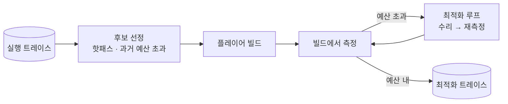

**[미실측]** pipeline 서버를 **빌드 안에서** 구동할 수 있는지. `unity command` 에
`--runtime <player exec name>` 과 `--runtime-path <path>` 가 있어 실행 중인 Unity Player 에
붙을 수 있게 돼 있다 — 진짜 빌드에서 재는 길이 될 수 있지만 아직 해 보지 않았다.
확인 전에는 빌드 정확도에 대해 아무것도 주장하지 않는다.

### 9.5 범위 밖 — 가중치 학습

백엔드가 우리가 못 건드리는 CLI 에이전트라 파인튜닝은 범위 밖이다.
다만 **부산물은 남는다**: `(프롬프트, 생성물, 검증 판정)` 은 정확히 검증가능보상(RLVR) 학습 데이터의 모양이다.
훈련하지 않아도 *"이 루프의 부산물은 검증된 학습 데이터셋"* 은 참이다.

---

## 10. 벤치마크 — 없으면 개선을 주장할 수 없다

이 프로젝트의 정체성은 **"측정으로 답한다"** 이다.
자기개선은 자기기만이 특히 쉬운 영역이라(학습에 쓴 목표에서만 잘하게 되는 것),
**"똑똑해졌다"를 느낌으로 주장하는 순간 그동안 쌓은 신뢰가 무너진다.**

```
Benchmark/goals.jsonl                # {id, set, tags, goal}
Benchmark/results/<id>/summary.json  # 추적 — 숫자
.agentloop/bench/<id>/               # 무시 — 목표별 span 트레이스 전문
```

**[현재]** 목표 18개(train 12 · holdout 6)와 `agentloop --bench` 러너가 있다.

- **학습용 / 홀드아웃 분리** — 스킬·예산은 `train` 에서만 조정한다
- 평균 스텝은 **통과한 목표만** 센다. 실패는 `--max-steps` 에서 잘려 평균을 유리한 쪽으로 끌기 때문
- 목표 사이에 러너가 **그 목표가 만든 파일만** 지우고 리컴파일해, 다음 목표가 깨끗한 상태에서 시작한다

### 베이스라인 — `20260817-121624` 기록 완료

**[현재]** `claude-code:sonnet`, `--max-steps 6`, 스킬 3종, 정확성만, 18목표 약 30분.

| 분할 | 통과 | 평균 스텝 | 평균 벽시계 |
|---|---|---|---|
| **holdout** | **6/6 (100%)** | **1.33** | 141.4s |
| train | 12/12 (100%) | 1.17 | 80.0s |

수리가 필요했던 4개는 **전부 루프가 잡은 진짜 결함**이었다 — 테스트 실패 3건, 그리고
적용 전에 반려된 도메인 규칙 위반 1건. **18목표 전체에서 인프라성 실패 0건**으로,
이게 처음 성립한 스윕이다(직전 시도는 도메인 리로드 경합을 모델 탓으로 돌리다 2/18 에서 중단했다, §9.4).

**이 베이스라인이 보여 줄 수 없는 것.** 100% 라 성공률에는 **여유가 없다** — 이 숫자는 퇴보만 잡는다.
그리고 18개 중 14개가 원샷이라 평균 스텝의 전체 범위가 1.00~1.22 다. **얇은 신호**다.

### 목표를 어렵게 해도 안 됐다 — 실측

**[현재]** 모델이 걸릴 함정을 정조준해 `hard` 12개를 썼다(비활성 중 코루틴 정지, 이벤트 멱등성,
FixedUpdate 타이밍). 결과는 **12/12 원샷, 평균 1.00** — 쉬운 tier 보다 **여유가 더 없다.**

루프를 안 바꾸고 다시 돌린 것도 노이즈를 그대로 드러냈다: 동작이 같은 코드로 두 번 돌려
`all` 1.22↔1.44, holdout 1.33↔1.17, 18개 중 9개가 **양방향으로** 스텝을 바꿨다.
실행 간 흔들림(0.22)이 이론적 개선 여지(0.33)의 대부분이다. **완벽한 루프도 이 방식으론 증명 못 한다.**

진단은 "목표가 쉽다"가 아니라 더 날카롭다 — **이건 모델을 재지 루프를 재지 않는다.**
루프는 뭔가 틀렸을 때만 일하는데, 유능한 모델은 대개 안 틀린다.

### 결함 주입 — 수리를 잰다, 그게 제품이니까

**[현재]** `Benchmark/faults/*.json` 은 **실제로 검증에 실패했던** 첫 응답을 담는다.
`--bench-faults` 가 그걸 step 1 로 재생하고, step 2 부터 진짜 모델이 인계받는다.

```
step 1   저장된 결함 응답 재생   → 원래처럼 검증이 잡는다
step 2+  실제 모델이 수리       → 스텝 수가 **루프**를 잰다
```

| | 목표 벤치 | 결함 주입 |
|---|---|---|
| 재는 것 | 모델이 한 번에 맞히나 | **루프가 얼마나 빨리 고치나** |
| 루프 기여도 | 거의 없음 | 전부 |
| 출발점 | 매번 다름 | **고정** |
| 등록되는 개선 | 거의 없음 | 피드백 개선·스킬·best-of-N |

**결함은 기록하지 발명하지 않는다** — 스킬 검사와 같은 규칙이고 이유도 같다. 하루에 세 번이나
내가 고른 난이도가 틀렸다. 인프라 실패는 제외한다: 도메인 리로드 경합이 원인인 후보 3개를 뺐다(§9.4).
넣었으면 오귀속을 라이브러리에 각인시키는 셈이고, 환경 탓이라 재현되지도 않는다.

현재 라이브러리는 세 검증층을 모두 덮는다(정적 2 · 컴파일 1 · 런타임 5).
샘플 게임의 실제 실패도 여기로 들어와, **루프가 자기 회귀 테스트를 스스로 생산**하게 된다.

### 수리 베이스라인 — `20260817-152343` 기록 완료

**[현재]** 결함 8개 전부, `claude-code:sonnet`: **8/8 수리**, 평균 **2.125**스텝(원본 2.375).

**재현이 정확하다** — 8개 모두 step 1 에서 원본과 **같은 노드·같은 메시지**로 실패했다.
출발점을 고정한 대가다: 목표 벤치는 동작이 같은 코드 두 번에 18개 중 9개가 흔들렸는데
이쪽은 8개 중 1개다.

**그런데 바닥이 1 이 아니라 2 다.** step 1 은 주입한 결함이라 **항상** 실패하므로,
최선이 2.00(결함 → 수리 1회)이다. 2.125 면 여유가 **0.125스텝**이고,
수리를 두 번 이상 시도해야 한 건 `object-pool` 하나뿐이다.

즉 이 계기도 **거의 포화**다. 이유는 분명히 적어 둘 만하다 —
**구체적인 에러 메시지가 주어지면, 루프의 피드백은 단일 결함을 첫 시도에 거의 항상 고친다.**
그래서 이건 강한 **회귀 방지 장치**(피드백을 망가뜨리면 스텝이 오르거나 수리가 실패)이지만
진척 계기판으로는 약하다 — 목표 벤치가 다른 길로 도달한 것과 같은 결론이다.

**세 번의 시도가 만든 패턴**이 진짜 발견이다: 목표 · 더 어려운 목표 · 결함 주입이 모두 포화됐다.
루프는 **고립된 단일 컴포넌트에서 측정 가능한 모든 것에 이미 능하다.**
안 재어진 채 남은 건 실제 프로젝트가 필요한 영역 — 기능 간 통합, 코드 축적, 시스템 간 계약(§7·§8)이다.
결함을 진척 계기판으로 만들려면 **3스텝 이상** 걸리는 것이어야 한다.
새로 추출할 때 `originalSteps >= 3` 을 우선한다.

측정하지 **않는** 것도 분명히 해 둔다 — 예방이다. 스킬의 가치는 그 코드가 애초에 안 나오는 것인데,
결함을 주입하면 그걸 우회한다. 예방은 목표 벤치의 위반율로 본다.
- 지표: `성공률 · 평균 스텝 수 · 벽시계`
- 베이스라인을 먼저 기록하고, 이후 모든 개선은 **홀드아웃 대비**로만 말한다

목표하는 문장의 모양:

> 홀드아웃 20목표: 평균 3.4스텝 → 스킬 증류 후 **1.9스텝**, 성공률 70% → 90%

벤치마크는 §2 의 바깥 루프에도 필요하다 — **"Agent 분해 vs 사람 분해"** 를 비교해야
바깥 루프가 실제로 이득인지 말할 수 있다.

---

## 11. 구축 순서

| | 단계 | 왜 이 순서인가 |
|---|---|---|
| 0 | ~~**RunStore + Span 트레이스**~~ **[완료]** | 매일 버리던 재료를 줍는 것. 모든 후속 단계의 전제 |
| 0 | ~~**벤치마크 + 베이스라인**~~ **[완료]** | 이게 없으면 이후 어떤 개선도 측정 불가. 베이스라인 `20260817-121624`: holdout 6/6, 1.33스텝 |
| 1 | **노드 추출** | 회귀 기준: 데모 5종이 **같은 판정**을 내야 함 |
| 2 | **그래프 선언 · 정책** | 타깃이 자기 서브그래프를 선언, `Supports` 분기 흡수 |
| 3 | **RED 게이트 + TDD 사이클** (§4) | 헛테스트 차단. 노드 계약 위에 바로 얹힘 |
| 4 | **트레이스 시각화** | 층 트리를 그림으로 — 포폴 회수 지점 |
| 5 | **작업 분해 + 바깥 루프** (§2) | 트레이스 신호가 있어야 분해를 판정할 수 있다 → 0·4 이후 |
| 6 | **Calibrator** (§9.1) | 첫 자기개선. 작고 명확 |
| 7 | **best-of-N** (§5.4) | 그래프여야만 가능한 구조 |
| 8 | **Distiller** (§9.2) | 본편 |

0단계 둘은 **그래프 없이도 지금 된다.** 오히려 먼저 해야 트레이스가 *무엇을 기록해야 하는지* 정해진다.

**직교하는 것들** — 이 순서에 매이지 않고 필요한 시점에 끼워 넣는다.

| | 언제 필요해지나 | 전제 |
|---|---|---|
| **멀티세션** (§7) | 결합된 컨텐츠를 병렬로 돌려야 할 때 | 1~2단계의 노드 계약 |
| **계약 · 삭제 게이트** (§8) | **기능이 둘 이상 되는 순간부터** | 소유권(§3.2) |

§8 은 특히 미루면 비싸진다. 계약 없이 쌓인 코드는 나중에 소급해서 *"이게 왜 있지"* 를
복원해야 하는데, 그때는 이미 이유가 사라진 뒤다.

---

## 12. 기존 설계 결정과의 정합

[핵심 설계 결정](../CLAUDE.md)을 바꾸지 않는다. 오히려 강화한다.

| 결정 | 이 아키텍처에서 |
|---|---|
| **D1. 루프는 우리 것** | 흐름 제어가 노드 밖 실행기에 **더 명시적으로** 모인다. 백엔드는 여전히 도구 없는 텍스트 생성기 |
| **D2. 두 축 pluggable** | 타깃이 서브그래프를, 백엔드가 팬아웃 후보를 제공한다 |
| **D3. C# 단일** | 그대로 |
| **D4. 검증이 1급 시민** | 검증이 **일급 노드**가 되고, 판정 기준(테스트·예산·계획) 자체가 검증·학습 대상이 된다 |

---

## 13. 미실측 총람

주장하기 전에 재야 하는 것들. 이 목록이 다음 실험 계획이다.

| # | 무엇을 | 왜 필요한가 | 절 |
|---|---|---|---|
| 1 | pipeline 서버의 동시 요청 처리(큐잉? 거부? 경합?) | **리스 설계의 전제.** 이미 큐잉한다면 절반은 불필요 | §7.4 |
| 2 | 도메인 리로드 중 들어온 명령의 실제 실패 모양 | `Fatal` 판정 기준 | §5.5 |
| 3 | `.csproj` 컴파일과 에디터 컴파일의 에러 일치율 | 사전 검사를 "반려"로 쓸 수 있는지 | §7.8 |
| 4 | EditMode ↔ PlayMode 사이클 시간 차이 | RED 게이트 비용의 실제 크기 | §4.5 |
| 5 | 구조 지표와 "좋은 코드"의 상관 · 오탐률 | 구조 예산을 채택할지 | §4.3 |
| 6 | Agent 분해 vs 사람 분해 | 바깥 루프가 실제로 이득인지 | §2, §10 |
| 7 | 단조 세분화의 실측 수렴 스텝 수 | 이론상 유한이지만 실제 비용은 모른다 | §2.4 |
| 8 | **고아 판정의 오탐률** | 리플렉션·`SendMessage`·`UnityEvent`·`[MenuItem]` 이 안 잡힌다. **삭제 자동화의 전제** | §8.7 |
| 9 | 기능별 asmdef 분할의 컴파일 시간 효과 | 분할이 오히려 늘리는 경우도 있다 | §8.4 |
