# Architecture — a loop that gets verified

[한국어](ARCHITECTURE.ko.md)

> This document defines the **flow**. The *why* behind each choice lives in [DESIGN.md](DESIGN.md)
> (Korean); what broke along the way is in [WORKLOG.md](WORKLOG.md) (Korean).

Notation — **[now]**: in the code · **[planned]**: not built yet · **[unmeasured]**: not claimed
until measured. Keeping that distinction sharp is the discipline this project runs on.

---

## 0. The principle that runs through everything

> **Anything that can be wrong gets verified and fed back.**

Not just the code. The **tests** can be wrong (§4.2), the **budgets** can be wrong (§9.1), and the
**plan** can be wrong (§2). All of them get the same treatment: state a criterion, measure it, and
route failures back.

A single run descends through four layers. Those layers are stitched together by **one trace tree**
(§6), and between runs that record updates the criteria and the domain knowledge (§9).

Without the first half you cannot trust the result; without the second half you make the same
mistake tomorrow that you made today.

---

## 1. The map

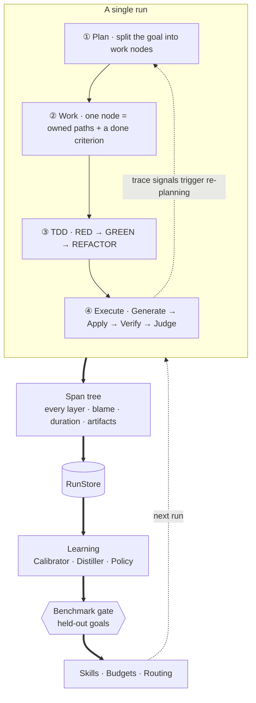

| Layer | What it decides | § |
|---|---|---|
| ① Plan | **what to split the goal into** — itself subject to verification | §2 |
| ② Work | one node's **boundary and done criterion** | §3 |
| ③ TDD | **in what order** a node turns green | §4 |
| ④ Execute | how one step is **applied and verified** | §5 |
| Record | all of the above **as one tree** | §6 |
| Learning | updating the criteria **between runs** | §9 |

Two axes cut across these: **space** (many sessions sharing one editor, §7) and **time**
(features accumulating in one codebase, §8).

**Learning never runs on the hot path.** It is a separate command; a run only reads its *output*.
That way every run is pinned to the skills and budgets it actually used, and stays reproducible.

---

## 2. The plan layer — decomposition is also looped

The work graph is not handed down by a human — **the agent produces it**. So it can be wrong.
Which means the loop has two nested levels.

| | Inner loop (§5) | Outer loop (§2) |
|---|---|---|
| Fixes | **code** | **the plan** |
| Failure signal | compile · tests · budgets | **trace signals** |
| Feedback | errors → model | trace summary → model |
| Cost of one step | one model call | **an entire work-graph run** |

The outer loop has the **same five stages** — generate (decompose) → apply (commit the graph) →
verify (run it and collect signals) → feed back → judge. It is the same engine one level up.

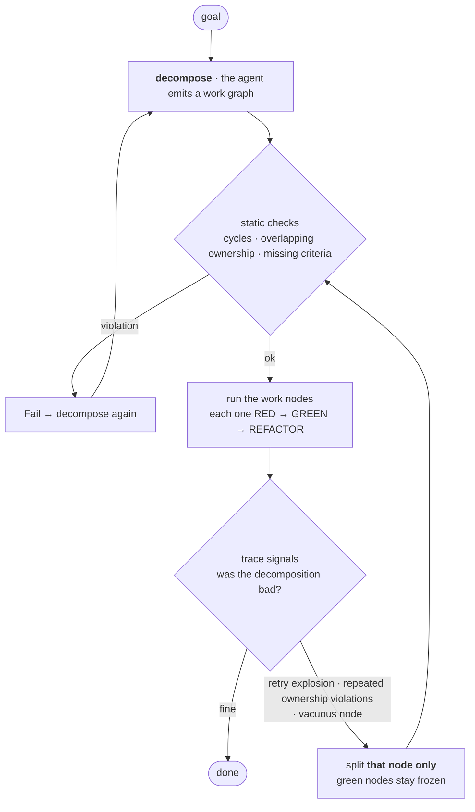

### 2.1 The output of decomposition is not a list of nodes

Without a **done criterion** per node, verification is impossible. So each node is a tuple:

```
{ id, goal, owns[], reads[], dependsOn[], doneCriterion }
```

**`doneCriterion` becomes that node's test**, and the RED gate (§4.2) then verifies the test itself.
Decomposition → criterion → test → RED gate is one unbroken chain.

### 2.2 Signals of a bad decomposition — already observable

The outer loop works because **the instrumentation to judge a plan already exists** (§6).

| Signal | Where it shows | What is wrong | |
|---|---|---|---|
| one Work span retried more than N times | Work retry count | **the node is too big** | dynamic |
| ownership violations repeat on the same node | Apply `Fail` reason | **the boundary is wrong** — it cannot finish without touching someone else's files | dynamic |
| RED gate keeps passing vacuously | RedGate `Fail` | **a node with no substance** — nothing to verify | dynamic |
| a later node cannot find an earlier node's types | VerifyCompile pattern | **dependency order is inverted** | static |
| A → B → A | the work graph itself | **cyclic dependency** | static |

### 2.3 Static checks — reject before applying

Dynamic signals are expensive (you have to run to get them), so catch what you can up front.
**What skill `CHECKS` do for code, plan checks do for the decomposition** — same position, same pattern.

- no cyclic dependencies
- no overlapping owned paths between nodes (§7.3)
- every node has a done criterion
- the contract node precedes everything that depends on it

### 2.4 Monotone refinement — preventing divergence

The classic failure of a planning loop is **the plan changing forever and nothing finishing**.
So re-planning is, in principle, restricted to **splitting**.

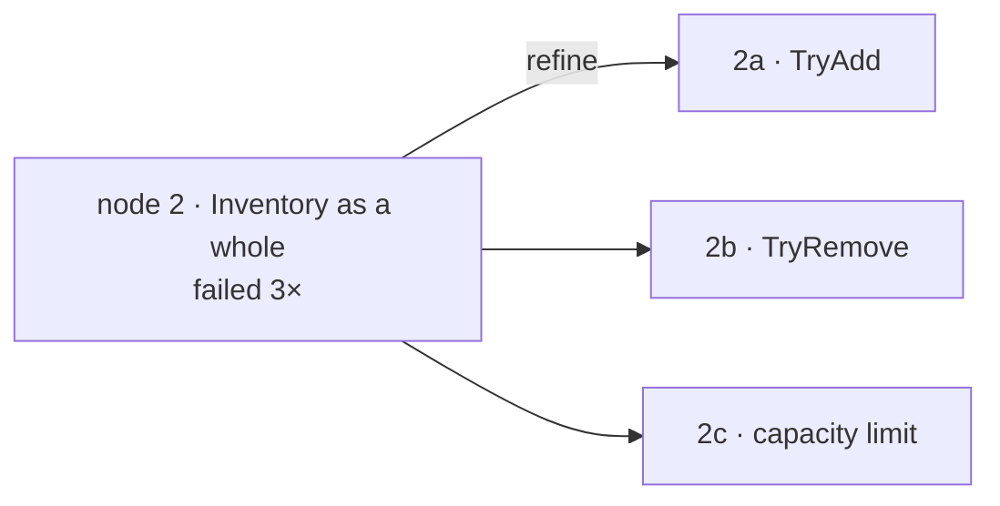

- green nodes are **never touched** (§3.2)
- node size **decreases monotonically**, so it converges in a finite number of steps
- refining is literally adding children in the span tree — **the decomposition tree is the trace tree**

**Splitting does not always help.** If the boundary itself is wrong (the coupling is so strong that
it should have been one node), splitting further will not fix it. → After N refinements, escalate to
a **boundary redesign** with a hard cap; when that is exhausted too, **report to a human.**
Better to stop and say so than to diverge quietly.

### 2.5 What gets fed back when re-planning

Not an error string — a **trace summary**.

> `node 2 (Inventory)` failed 3 times; 2 of those were rejected for trying to write under
> `Assets/Scripts/Quest/`. This node depends on types owned by Quest.

You cannot build that summary from a flat log — see §6.3.

---

## 3. The work layer — one node

### 3.1 Why splitting *is* the efficiency

The struggle with history windows and feedback caps came down to one thing:
*we generate too much at once.*

| | Generate it all | Per node |
|---|---|---|
| Failure attribution | "something is wrong" | **this small change is wrong** |
| Context per step | every file, every time | just this node and the contract |
| Parts already green | regenerated every step | **frozen — never rebuilt** |

### 3.2 Freezing and ownership

That third row matters most. **[now]** at step 3 the model re-emits the perfectly good file from step 1.
**[planned]** once a node is green, its files become **read-only** to later nodes.

Each node declares the paths it will write, and the `Apply` node enforces it:

```
{ "id": "quest",
  "owns":  ["Assets/Scripts/Quest/**", "Assets/Tests/PlayMode/Quest*"],
  "reads": ["Assets/Scripts/Contracts/**"] }
```

- writing outside its ownership → `Fail` (the model's fault, so feedback can fix it)
- overlapping ownership between nodes → refuse to start (better now than later)

The same machinery is reused for multi-session work (§7.3).

---

## 4. The TDD cycle — turning one node green

### 4.1 RED in a statically typed language needs a skeleton

In C#, "test first" **does not compile** — it references types that do not exist yet.
So the RED artifact is not a test, it is **skeleton + test**.

```csharp
// The skeleton is the contract. It compiles, but does nothing yet.
public sealed class Inventory
{
    public bool TryAdd(ItemId id, int count) => throw new NotImplementedException();
}
```

**That skeleton is the contract.** Doing TDD gets you contract-first for free — another node or
session can write its own tests against the skeleton before any implementation exists.
**The test is an executable specification.**

### 4.2 The RED gate — catching tests that pass vacuously

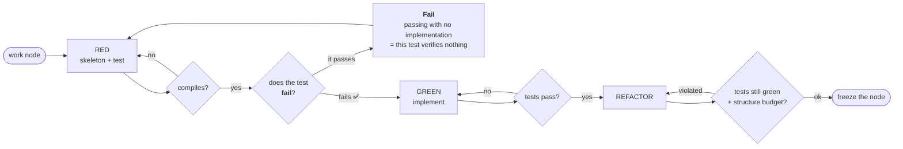

The `RT` diamond is the whole point of this section. **[now] the loop's biggest weakness is that the
model writes both the test and the implementation** — grading its own exam. That is why the feedback
text says *"do not weaken the test to make it pass"* — which is really an **admission** that it can.

The RED gate turns that into structure: **a test that passes without an implementation is worthless.**

> This is not an invention. It is what was done by hand while verifying touch input — check first
> that reading before advancing a frame **fails** with `Expected: Began / But was: None`.
> A human did it then; a node does it now. ([WORKLOG](WORKLOG.md))

### 4.3 REFACTOR without a criterion is just random change

Red→Green is verifiable. But what decides that *"make it SOLID, raise cohesion"* succeeded?
**Green tests only mean you did not break it — not that you improved it.**

This project's answer is already fixed: **measure it and make it a budget.**
Time budget → render budget → **structure budget**.

| Metric | What it catches | Cost |
|---|---|---|
| file / method length | bloated responsibility | cheap |
| public surface per type | broken encapsulation | cheap |
| interfaces with exactly one implementation | **over-abstraction** | cheap |
| dependency direction and cycles | coupling | medium (reference graph) |

This promotes the existing skill `CHECKS` machinery (`Skills/`, `CSharpSource`) into a budget —
not new infrastructure.

### 4.4 The metric has to cut both ways

Reward "more abstraction is better" and the model will attach three interfaces and a factory to a
20-line class. That is a known LLM failure mode. So the structure budget raises cohesion while
**refusing to add indirection**: interfaces with a single implementor, wrappers that only delegate,
and similar YAGNI signals are violations.

The skill rule still applies — *target mistakes models actually make, and measure the false-positive
rate against existing output first.* Structure metrics get **backtested on past output** before adoption.

### 4.5 Cost — prefer EditMode

The RED gate spends one extra verification cycle, and in multi-session work that increases editor
lease contention.

Mitigation: **run pure logic as EditMode tests.** No play mode entry, no domain reload wait.
Keep PlayMode only for frames, input, and coroutines.
**[now]** all our tests are PlayMode, so many could move down.
**[unmeasured]** how much faster that actually is.

---

## 5. The execution graph — one step

### 5.1 The graph

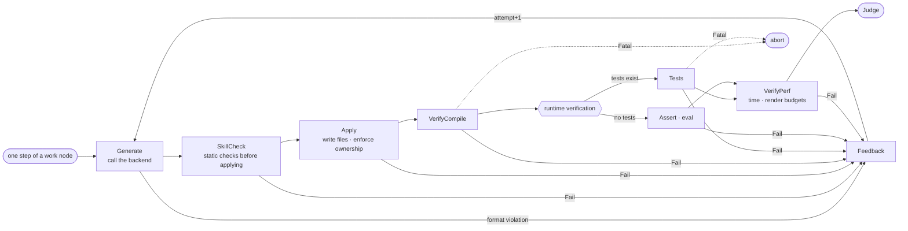

**[now]** this flow already works — but it is **hardcoded** inside
[`AgentLoop.RunAsync`](../Orchestrator/Loop/AgentLoop.cs) as `for` + `if` + `continue`.
What follows is that flow lifted into data.

### 5.2 The node contract

```csharp
public interface INode
{
    string Name { get; }
    Task<NodeOutcome> RunAsync(RunContext ctx, CancellationToken ct);
}

public sealed record NodePolicy(
    int       MaxRetries   = 0,      // retry the node itself (not another model call)
    TimeSpan? Timeout      = null,
    bool      FatalOnError = false); // is an exception Fatal, or just Fail?
```

A node only makes **its own judgment**. Routing, retries, timing, and recording belong to the executor.
The point is that a node never calls `continue` — once flow control leaves the nodes, "add one more
verification" changes from *surgery* into *registration*.

**[now]** `EvalWithRetryAsync` (one retry right after a domain reload), play-mode ready gating, and
`recompile_status` polling are all hand-rolled retries. As policy they stop being rewritten per node.

### 5.3 NodeOutcome — five branches

| Outcome | Whose fault | Routing |
|---|---|---|
| `Pass` | — | next node |
| `Fail` | **the model.** It can fix this | feedback → regenerate |
| `Skip` | — (no criterion / target does not support it) | next node (counts as passing) |
| `Blocked` | **another session.** My code is fine | wait and retry (§7.5) |
| `Fatal` | **infrastructure.** The model cannot fix it | abort immediately |

**The middle column is the whole table.** The branches are not split by *what happened* but by
**whose fault it is** — because blame decides routing. Only the model's mistakes go back to the model.

Separating `Fail` from `Fatal` was expensive to learn. A play-mode entry refused right after a
recompile was once fed back as *"your code is wrong"*, burning a step regenerating perfectly good code.
**[now]** an exception enforces this implicitly; in the graph it becomes **explicit policy**.

`Skip` collapses the success exits into one. **[now]** "no criterion → return success immediately"
appears in [three places](../Orchestrator/Loop/AgentLoop.cs). Judgment should happen once, at the end.

### 5.4 Resource leases — honest parallelism

**The editor is an exclusive resource.** Both Tests and Perf must enter play mode, so they cannot run
at the same time. "Parallelize verification" **does not hold** for this target.

Where parallelism is real is **generation**. The slow part is the model call (minutes), not
verification (tens of seconds).

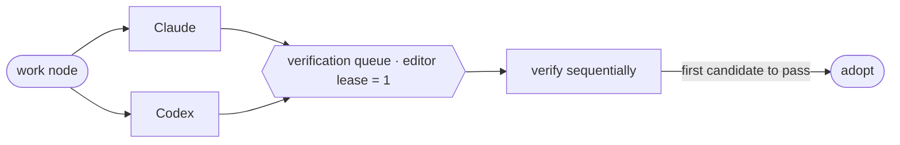

**[planned]** best-of-N. It sits directly on top of the agent-agnostic property already demonstrated —
from *"two agents can drive the same loop"* to *"two agents compete and verification is the judge."*

### 5.5 What a verification node actually talks to

**[now]** this order was established by measurement. In particular, **polling and ready gating** are
not optional — without them it breaks.

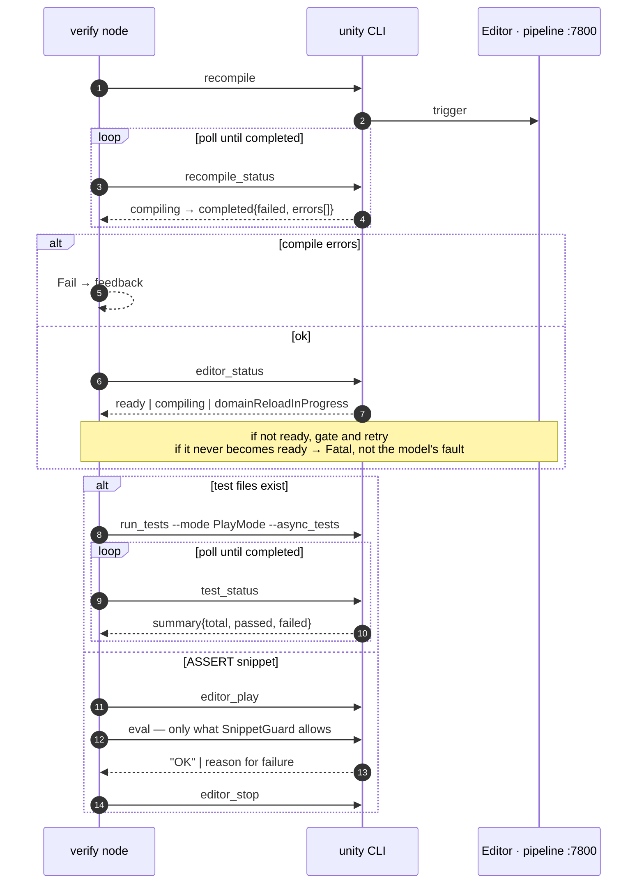

Polling appearing twice is not a coincidence. **PlayMode tests cannot run synchronously**, and
**play mode entry is silently refused right after a recompile**. Both were found by measurement, so
in the graph they are expressed as **policy (retry, timeout)** rather than ad-hoc code inside a node.

---

## 6. The trace — the spine that ties every layer together

### 6.1 It is a tree, not a flat list

Plan, work, TDD, and execution are bound into **one trace tree**. Record them separately and you lose
"which step of which work node did this failure come from".

```csharp
public sealed record Span(
    string   RunId,
    string   SpanId,
    string?  ParentSpanId,     // ← this one line makes it a tree
    SpanKind Kind,             // Work | Phase | Node | Lease
    string   Name,             // "Inventory.TryAdd" | "RED" | "VerifyCompile" | "editor"
    string?  SessionId,        // who, in multi-session work (§7)
    Outcome  Outcome,          // Pass | Fail | Skip | Blocked | Fatal
    string?  BlamedOn,         // when Blocked, who is blocking
    double   Ms,
    IReadOnlyList<string> Errors,
    IReadOnlyList<string> Artifacts);
```

The executor emits these, not the nodes. You cannot learn from a text log — **it has to be tuples.**
`Kind` having four values is not arbitrary: the three execution layers plus the **lease** (§7.4).
Waiting is a first-class thing to record.

### 6.2 One run's tree

**[planned]** what the trace visualization (§11, build order step 4) will generate:

```
run 20260816-1442  "quest rewards land in the inventory"                     ✅ 6m12s
├─ work  contract · ItemId / IInventory                                      ✅ 1m03s
│  ├─ RED    skeleton + test                                                 ✅ 41s
│  │  ├─ Generate        claude                                              ✅ 28s
│  │  ├─ lease  editor   waited 0s                                           ✅
│  │  ├─ Apply                                                               ✅ 0.3s
│  │  ├─ VerifyCompile                                                       ✅ 9s
│  │  └─ RedGate         does the test fail?                                 ✅ 3s
│  └─ GREEN                                                                  ✅ 22s
├─ work  Inventory.TryAdd                                                    ✅ 2m28s
│  ├─ RED    (2 attempts)                                                    ✅
│  │  └─ RedGate         Fail — passed with no implementation (vacuous test)
│  ├─ GREEN                                                                  ✅
│  └─ REFACTOR  structure budget  public surface 7→3                         ✅
└─ work  reward payout integration                                           ✅ 2m41s
   ├─ lease  editor      waited 1m14s  ← held by session B                   ⏳
   └─ ...
```

This one tree answers:

| Question | From |
|---|---|
| which **work item** struggled most | Work span retries → **decomposition quality** (§2.2) |
| what **vacuous tests** this model writes | accumulated RedGate `Fail` → Distiller (§9.2) |
| whether the multi-session bottleneck is real | Lease span wait time → validates §7 |
| time lost to someone else | `Blocked` + `BlamedOn` aggregation |
| where to resume | last `Pass` span |
| what to set a budget to | distribution of measurement spans → Calibrator (§9.1) |

**Splitting outcomes by "whose fault" (§5.3) pays off here.** Every span carries blame, so an
aggregate produces *"4 model mistakes, 1m14s blocked by others, 0 infrastructure failures"* for free.

### 6.3 Why a flat log will not do

A flat event list still produces a log. But **you cannot learn from it.**
If you do not know *which work node, which phase, which attempt* a compile error belongs to, it is
just an error string, not a learning signal — and the re-planning feedback in §2.5 cannot be built.

**`ParentSpanId` is what turns a log into a dataset.**

### 6.4 RunStore

**[now]** run logs go to `%TEMP%/agentloop-runs/`. In other words the hardest-to-obtain data there is —
*what the model got wrong and what fixed it* — is produced and then left for the OS to delete.

**[planned]** move to `.agentloop/` at the repo root (gitignored).

```
.agentloop/runs/<runId>/
  run.json          # goal · backend · target · option snapshot · verdict · wall clock
  trace.jsonl       # Span stream (append-only; the tree is rebuilt from ParentSpanId)
  spans/<spanId>/   # large artifacts hang off their span
    reply.txt · edits/*.cs · compile.log · test-result.json
  evidence/*.png
```

- `run.json` snapshots **the skills and budgets in effect at the time** — otherwise later comparison is meaningless.
- `trace.jsonl` is **append-only**, so a crashed run still leaves a rebuildable tree.
- No secrets are stored. The existing rule of logging only key *names* (never values) stands.
- Runs worth keeping as portfolio evidence are promoted to `docs/evidence/` — working data and
  evidence do not mix.

---

## 7. Multi-session — one editor, many sessions

Real development is not one feature at a time. You build quests and inventory together, plus the
editor tooling for them. And **quests are coupled to inventory** — rewards grant items, and having an
item is what clears a condition.

Run several sessions against one editor and one of them stalls. Start by being precise about why.

### 7.1 What actually collides

| Collision | Why | Symptom |
|---|---|---|
| **Compile domain** | one `Assets/`, and recompiles are global | **someone else's errors arrive as my model's feedback** |
| **Domain reload** | a reload invalidates commands already in flight | `eval` / `test_status` timeouts — the "stall" |
| **Play mode** | exclusive resource | `editor_play` is silently refused |
| **Files** | two writers on one file | last write wins, earlier work vanishes |

The first row is the dangerous one. If session A writes broken code, session B's compile check fails
too, and **B's model receives errors from code it never wrote and regenerates perfectly good files.**
Same class of waste as feeding back infrastructure failures — except the cause is *someone else*.
→ hence `Blocked` in §5.3.

### 7.2 The session graph — lock the contract first

When building coupled content in parallel, the real problem is not the editor — it is **agreement**.
If two sessions each invent their own `IInventory`, the results do not merge.
And **agents cannot negotiate with each other.**

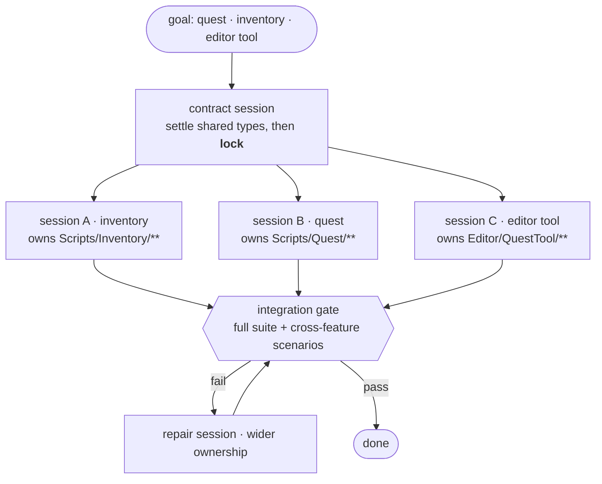

Contract files are **owned by nobody** (read-only). A session that tries to change the contract gets a
`Fail`. Deciding that *the contract is wrong* belongs to the **layer above** (§2).

**The session graph is the distributed form of the work graph (§2).** Run the same decomposition
sequentially in one process and it is a work graph; hand it to several sessions and it is a session
graph. The skeleton from §4.1 serves as the contract in both.

### 7.3 Ownership

Exactly the machinery from §3.2. If ownership overlaps at session start, refuse to start.

### 7.4 The editor lease — turn "stalled" into "queued"

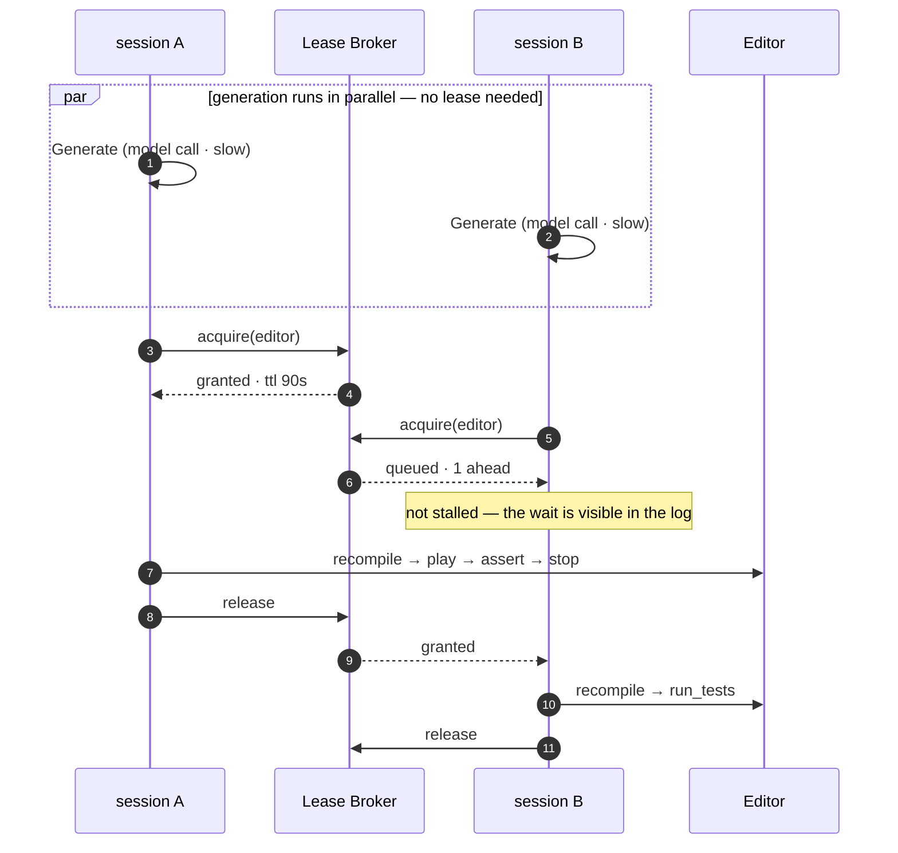

1. **The lease covers the whole verification sequence, not individual commands.** Lock
   `recompile`, `editor_play`, `eval`, and `editor_stop` separately and someone slips into the gap.
2. **TTL + heartbeat.** A dead session holding the lease forever stops everyone. Expire and reclaim it.
3. **The wait must be visible.** `"waiting for editor lease — 1 ahead"` is design, not a bug.
   Half of what feels like "stalling" today is simply **an invisible wait**.

Generation being outside the lease is the key (§5.4). Even with serialized verification, throughput
scales close to linearly with session count.

### 7.5 Blame attribution — someone else's error is not mine

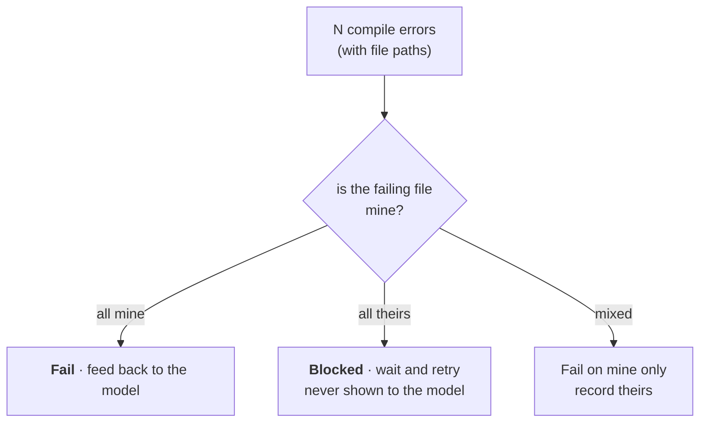

- **Compile**: `recompile_status` errors carry file paths, so ownership splits them.
- **Tests**: `run_tests --filter` restricts to my assembly/namespace (**[now]** already supported).
- **Perf / render**: measurement is global, so another session's play mode contaminates it →
  **measure only inside the lease.**

`Blocked` needs a backoff cap. Instead of waiting forever, after N attempts report
"blocked by session X". **Do not endure a deadlock quietly — surface it.**

### 7.6 The integration gate

Everyone being green individually says nothing about them working together.
*"Does the quest reward actually land in the inventory"* cannot be verified by any single session.
After all sessions pass, run the **full suite plus cross-feature scenario tests**.

An integration failure is **nobody's individual fault**. It goes to a repair session that owns both sides.

### 7.7 Why isolation (worktrees) is not the answer

Give each session its own project copy and dedicated editor and both the lease and the signal
contamination disappear (`unity --project-path` supports it).
But **it does not fit coupled content.** Quest↔inventory integration is by definition only verifiable
together. Isolation helps *independent* work, and the actual problem is *coupled* work.
It is not cheap either (`Library/` reimport).

→ **Decision: shared editor + lease + attribution + contract-first.** Isolation stays as an option
for running many independent features at once.

### 7.8 Reducing lease contention

The most frequent verification is compiling. Unity generates `.csproj` files for IDEs, so it is
possible to compile **without the lease** first.

```
fast pre-check (no lease · .csproj)  →  most syntax errors rejected here
        ↓ only what passes
authoritative check (lease · editor recompile)
```

**[unmeasured]** Unity's compilation differs in define symbols, asmdefs, and compiler settings, so
there is no guarantee `.csproj` results match the editor. **Measure the agreement rate first**;
if it diverges, the pre-check may only be a *hint*, never a rejection.

---

## 8. One project — keeping it from rotting over time

The editor and the project **converge to one.** You can build many features at once, but the output
piles up in a single codebase. If §7 is *spatial* sharing, this section is the *time* axis.

### 8.1 The problem — the reason never lives in the code

You are building inventory. Quest needs to ask *"does the player have this item"* and the API does not
exist. The quest side adds `Inventory.HasItem()`. Then there are two roads, and **both are bad**.

| | What happens | Result |
|---|---|---|
| **Delete** | the inventory owner sees it → *"why is this here? nobody uses it"* | **quest breaks** |
| **Keep** | nobody dares touch it → it stays, unexplained | **garbage accumulates as you develop** |

There is one root cause — **why this code exists lives in *another feature's requirements*, and
nowhere in the code.**

Human teams fill that gap with review, `git blame`, a "who calls this?" message, and tribal knowledge.
**An agent has none of that.** It only sees its own slice.

### 8.2 Consumer-driven contracts — make the requirement a first-class asset

Ownership (§3.2) means quest **cannot** edit inventory files. So it **requests** instead.

```
Contracts/inventory.contract.json
  { "member":       "IInventory.HasItem(ItemId) -> bool",
    "requestedBy":  "quest.reward-condition",
    "why":          "a quest condition is cleared by holding an item",
    "consumerTest": "QuestTests.Condition_Clears_When_Item_Held" }
```

- the plan layer (§2) turns the request into a **work node** — *"inventory: satisfy the quest contract"*
- the **inventory owner** implements it. The boundary holds
- **the contract records who and why.** That is what the code could not do

`consumerTest` is the enforcer. If inventory deletes the member, **the quest test breaks** and the
integration gate (§7.6) catches it. That is exactly what consumer-driven contract testing does.

### 8.3 The deletion gate — inverting the problem

With contracts, *"is it safe to delete?"* becomes **mechanically decidable**.

| Internal callers | Contract | Verdict |
|---|---|---|
| yes | — | keep |
| no | **yes** | **keep** — someone else needs it. Change the contract first |
| no | no | **orphan — safe to remove** |

That third row is the point. **"Garbage accumulates" flips into "orphans get found and removed."**
Because live code is justified by contracts, whatever is *not* justified stands out immediately.

A deletion attempt is routed by §5.3 — trying to remove a member named in a contract is a `Fail`:

> This member is a contract item of `quest.reward-condition`. To remove it, change the contract first;
> that decision belongs to the plan layer.

Same rule as §7.2 — **deciding a contract is wrong belongs neither to the consumer nor the owner,
but to the layer above.**

### 8.4 asmdef — let the compiler enforce it

The orchestrator's path checks are rules *our code* honors. But **Unity gives you something stronger.**

```
Assets/Scripts/Contracts/   Game.Contracts.asmdef   (references nothing · leaf)
Assets/Scripts/Inventory/   Game.Inventory.asmdef  → Contracts
Assets/Scripts/Quest/       Game.Quest.asmdef      → Contracts, Inventory
Assets/Editor/QuestTool/    Game.QuestTool.asmdef  → Quest  (editor only)
```

- reference direction is **enforced by the compiler** — quest cannot secretly reach into inventory internals
- **Unity rejects cyclic dependencies outright** — one of §2.3's static checks comes free
- splitting assemblies enables **partial compilation**, shortening lease hold time (§7)

**[now]** we already use this machinery with `AgentLoop.Runtime.asmdef` / `AgentLoop.Tests.asmdef`.
Per-feature asmdefs are just an extension. **[planned]** have each work node carry its own asmdef in
the decomposition (§2.1).

### 8.5 Surface budget — a bloated module is evidence of a bad split

Two more entries for the structure budget (§4.3).

| Metric | Meaning |
|---|---|
| **orphan public members = 0** | no unjustified surface |
| **public surface cap per type** | above it, that module carries too many roles |

The second connects to the outer loop (§2.2) — **if inventory's surface keeps swelling, the split was
wrong.** "Inventory" was really two or three nodes → refinement trigger.

### 8.6 The birth record is already in the trace

*"Why is this member here"* is something the span tree (§6) already knows — which `Work` span touched
that file, under which goal.

If the contract is the **declared** reason, the trace is the **actual** one. When they disagree, that
too is a signal.

### 8.7 Unmeasured / open questions

- **Who writes the contract first** — does the consumer file a request, or does the plan layer predict
  and pin it? The former is accurate but adds round trips; the latter is fast but invents wrong contracts.
- Whether per-feature asmdef splitting **actually helps compile time** (splitting sometimes makes it worse).
- **False positives in orphan detection** — reflection, `SendMessage`, `UnityEvent` wired in the
  inspector, and `[MenuItem]` are invisible to static analysis. A Unity-specific hazard, so the
  false-positive rate must be measured before deletion can ever be automated.

---

## 9. The learning cycle — between runs

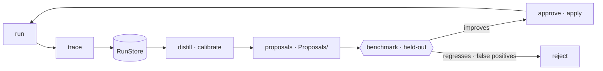

**Learners never write to the live path.** They only propose. Promotion is decided by the benchmark
and approved by a human. The classic failure of a self-improvement loop is **learning to game the
verifier**, and we already know the symptom — the feedback text pins down
*"do not weaken the assert to make it pass"* and *"do not raise the PERF budget to pass"*.
Once skills are generated automatically, **a bad skill can lower quality.** The gate is structural.

### 9.1 Calibrator — budgets from data

**[now]** the `maxTotalMs` in the `PERF` block is **proposed by the model itself.** Grading its own exam.
And the human-chosen numbers were tuned by getting burned — 12ms was flaky so it became 25ms;
draw calls went from 30 to 120.

**[planned]** accumulate the measurement distribution, derive a budget as `p95 × margin`, and use it to
**validate and correct** the model's proposal. Small, clear, and it removes a pain felt twice already.
A good first act of self-improvement.

### 9.2 Distiller — from failures into skills

**[now]** `Skills/*.md` are written by hand. But the rule for authoring them was already this:
*target **mistakes models actually make**, not things that are bad in theory, and measure the
false-positive rate against existing output first.*
**Mining the run records is the automated form of that rule.**

The same failure signature recurring N times proposes one `GUIDANCE` line plus one `CHECK` regex.
The key is that half of it — the `CHECK` — is **verifiable**: run it across all past output, measure
the false-positive rate, and adopt only if it passes. The knowledge is markdown, so it shows up in a
git diff and a human can say no.

### 9.3 Policy — routing

Backend, model, `--tests-only`, and the history window are **[now]** fixed flags.
Accumulate `(goal class, config) → steps to convergence` and routing becomes learnable.
Combined with best-of-N (§5.4) it turns into a bandit problem — give more generation budget to the
backend that has been winning.

### 9.4 Out of scope — weight training

The backends are CLI agents we do not control, so fine-tuning is out of scope.
But **the byproduct remains**: `(prompt, generation, verdict)` is exactly the shape of
reinforcement-learning-from-verifiable-rewards data. Even without training,
*"this loop's byproduct is a verified training dataset"* is true.

---

## 10. Benchmark — without it you cannot claim improvement

This project's identity is **"answer by measuring."**
Self-improvement is unusually easy to fool yourself about (getting better only at the goals you
trained on), so **the moment "it got smarter" is asserted on vibes, the credibility built so far is gone.**

```
Benchmark/goals.jsonl   # {id, goal, target, tags, holdout}
```

- 15–20 goals, **split into training and held-out**
- Metrics: `success rate · mean steps · wall clock`
- Record a baseline first; every later improvement is stated **against the held-out set only**

The shape of the sentence to aim for:

> Held-out, 20 goals: 3.4 steps on average → **1.9 steps** after skill distillation; success rate 70% → 90%

The benchmark is also required by the outer loop (§2) — you need to compare
**agent decomposition vs. human decomposition** before claiming the outer loop pays off.

---

## 11. Build order

| | Step | Why here |
|---|---|---|
| 0 | **RunStore + span trace** | picking up material currently thrown away daily. Prerequisite for everything after |
| 0 | **Benchmark + baseline** | without it, no later improvement is measurable |
| 1 | **Extract nodes** | regression bar: the five demos must reach the **same verdicts** |
| 2 | **Declared graph + policy** | targets declare their own subgraph; absorbs the scattered `Supports` branching |
| 3 | **RED gate + TDD cycle** (§4) | blocks vacuous tests. Sits directly on the node contract |
| 4 | **Trace visualization** | the layer tree as a picture — where the portfolio value is realized |
| 5 | **Decomposition + outer loop** (§2) | judging a plan requires trace signals → after 0 and 4 |
| 6 | **Calibrator** (§9.1) | first act of self-improvement. Small and clear |
| 7 | **best-of-N** (§5.4) | a shape only the graph makes possible |
| 8 | **Distiller** (§9.2) | the main event |

The two step-0 items **work without the graph and can be done today.** In fact doing them first is
what determines *what the trace needs to record*.

**Orthogonal concerns** — not tied to this order; slot them in when needed.

| | When it becomes necessary | Prerequisite |
|---|---|---|
| **Multi-session** (§7) | when coupled content must be built in parallel | the node contract from steps 1–2 |
| **Contracts + deletion gate** (§8) | **the moment there is more than one feature** | ownership (§3.2) |

§8 gets expensive if deferred. Code accumulated without contracts has to be reverse-engineered later
to answer *"why is this here"* — and by then the reason is gone.

---

## 12. Consistency with the existing decisions

The [core design decisions](../CLAUDE.md) are not changed. They are reinforced.

| Decision | In this architecture |
|---|---|
| **D1. We own the loop** | flow control gathers **even more explicitly** in the executor outside the nodes. Backends remain toolless text generators |
| **D2. Two pluggable axes** | targets supply subgraphs; backends supply fan-out candidates |
| **D3. C# only** | unchanged |
| **D4. Verification is a first-class citizen** | verification becomes a **first-class node**, and the criteria themselves (tests, budgets, plans) become subject to verification and learning |

---

## 13. The unmeasured list

Things to measure before claiming. This list is the experiment plan.

| # | What | Why it matters | § |
|---|---|---|---|
| 1 | how the pipeline server handles concurrent requests (queue? reject? race?) | **premise of the lease design.** If it already queues, half of it is unnecessary | §7.4 |
| 2 | the actual failure shape of a command sent during a domain reload | the criterion for `Fatal` | §5.5 |
| 3 | agreement rate between `.csproj` and editor compilation | whether the pre-check can *reject* or only *hint* | §7.8 |
| 4 | EditMode vs. PlayMode cycle time | the real cost of the RED gate | §4.5 |
| 5 | correlation between structure metrics and "good code" · false-positive rate | whether to adopt the structure budget | §4.3 |
| 6 | agent decomposition vs. human decomposition | whether the outer loop actually pays off | §2, §10 |
| 7 | measured convergence steps for monotone refinement | finite in theory; the real cost is unknown | §2.4 |
| 8 | **false-positive rate of orphan detection** | reflection, `SendMessage`, `UnityEvent`, `[MenuItem]` are invisible. **Prerequisite for automating deletion** | §8.7 |
| 9 | compile-time effect of per-feature asmdef splitting | splitting sometimes makes it worse | §8.4 |
